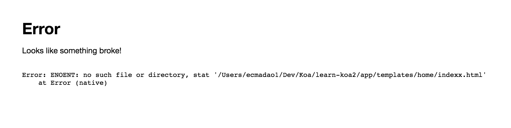

## learn koa2--tools

### Tools

- [koa-views](https://github.com/queckezz/koa-views/)

```bash
$ npm install koa-views@next --save
```

```javascript
// usage
import views from 'koa-views';

views(templateDirPath, option);

// 在templates文件夹下，以`.html`结尾的文件都会安装nunjucks模板进行处理
views(__dirname + '/templates', { map: {html: 'nunjucks' }});


// example
import Koa from 'koa';
import views from 'koa-views';

const app = new Koa();
app.use(views(__dirname + '/templates', {
  map: {
    html: 'nunjucks'
  }
}));

app.listen(7000);
export default app;
```

- [koa-logger](https://github.com/koajs/logger)

```bash
$ npm install koa-logger --save
```

```javascript
// usage
import Koa from 'koa';
import convert from 'koa-convert';
import logger from 'koa-logger';

const app = new Koa();
app.use(convert(logger()));

app.listen(7000);
export default app;
```

- [koa-router](https://github.com/alexmingoia/koa-router/tree/master)

> Koa路由系统
> 
> [koa-router usage](https://github.com/ecmadao/Coding-Guide/blob/master/Notes/NodeJS/KOA/learn%20koa2--router.md)

```bash
# for Koa2.X
$ npm install koa-router@next --save
```

- [koa-bodyparser](https://github.com/koajs/bodyparser)

> 解析request请求中的body成为Object

```bash
# for Koa2.X
$ npm install koa-bodyparser@next --save
```

```javascript
// usage
import Koa from 'koa';
import bodyParser from 'koa-bodyparser';

const app = new Koa();
app.use(bodyParser());

app.listen(7000);
export default app;
```

- [koa-json](https://github.com/koajs/json)

> pretty-printed JSON response middleware

```bash
$ npm install koa-json --save
```

```javascript
import Koa from 'koa';
import convert from 'koa-convert';
import json from 'koa-json';

const app = new Koa();
app.use(convert(json()));

app.listen(7000);
export default app;
```

- [koa-onerror]()

> 更优化的错误消息提示

```bash
$ npm install koa-onerror --save
```

```javascript
// usage
import Koa from 'koa';
import onerror from 'koa-onerror';

const app = new Koa();
onerror(app);

app.listen(7000);
export default app;
```

我们刻意的创建一个错误：

```javascript
router.get('/', async (ctx, next) => {
    await ctx.render('home/indexx', {
        title: 'home page',
        content: 'this is home page'
    });
});
```

因为并不存在`templates/home/indexx.html`，所以URL为`/`时页面在正常情况下报错如下：


而使用了`koa-onerror`之后则：



### Templates

- [nunjucks](https://github.com/mozilla/nunjucks)

```bash
$ npm install nunjucks --save
```

```javascript
// usage
// app/app.js
import nunjucks from 'nunjucks';
import Koa from 'koa';
import views from 'koa-views';

// 配置nunjucks模板文件所在的路径，否则模板继承时无法使用相对路径
nunjucks.configure(__dirname + '/templates', { autoescape: true });

const app = new Koa();
//views with nunjucks
app.use(views(__dirname + '/templates', {
  map: {
    html: 'nunjucks'
  }
}));

app.listen(7000);
export default app;
```

- [pug](https://github.com/pugjs/pug)

```bash
$ npm install pug --save
```

### Move to Koa2.X

因为Koa1.X和Koa2.X相比，中间件的方法有较大改变，所以如果把旧的中间件插件，例如`koa-logger`这样的，用在Koa2项目里时，就会在控制台输出不兼容警告。为此，我们需要一个`koa-convert`来把旧版本的中间件包裹起来做兼容。

- [koa-convert](https://github.com/koajs/convert)

```bash
$ npm install koa-convert --save
```

```javascript
// usage
import Koa from 'koa';
import logger from 'koa-logger';
import convert from 'koa-convert';

const app = new Koa();
app.use(convert(logger()));

app.listen(7000);
export default app;
```
