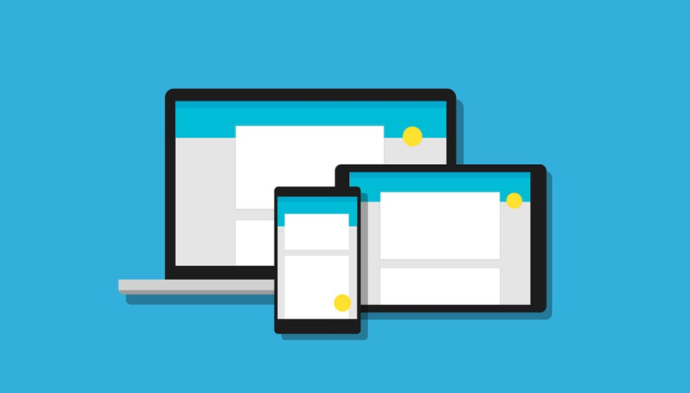
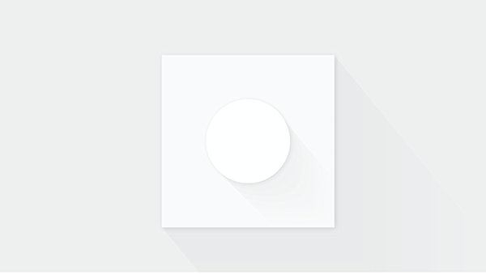
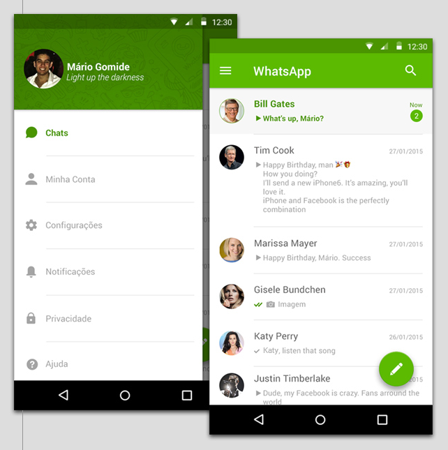
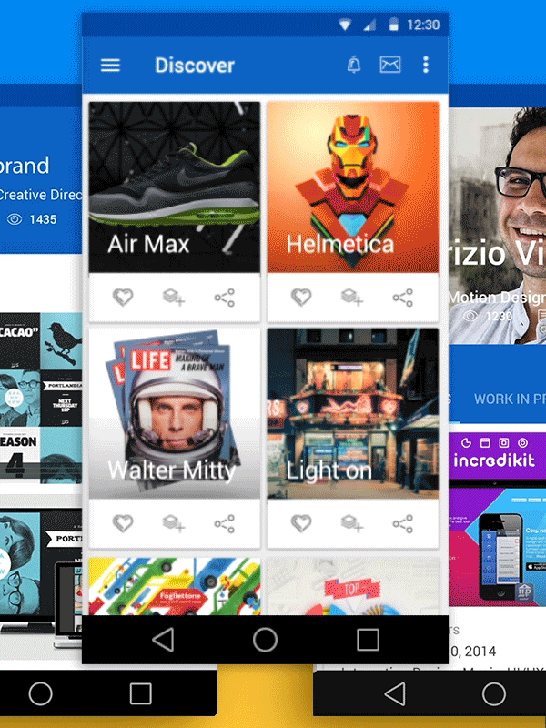
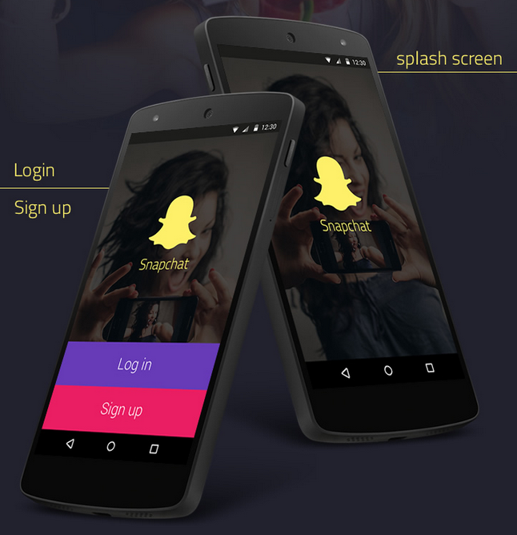

## Material Design 新手？来瞅瞅你需要知道的12条原则

> 本文译自： [New to Material Design? 12 Principles You Need to Know](http://blogs.adobe.com/dreamweaver/2015/05/new-to-material-design-12-principles-you-need-to-know.html)

Material Design现在变得很火了，许多设计师也不仅局限在Android项目中运用它，也开始在网页项目中运用了。

随口提一句，Material Design的概念最早是谷歌在[2014年开发者大会](https://www.youtube.com/watch?v=wtLJPvx7-ys#t=13m59)中提出的。到目前为止，这段演讲已经被查看了150万次以上，并且至今还被认为是了解和思考Material Design的一个极好的教程。

### Material Design适合你吗？

我们首先要解决的问题是：Material Design是否适合于你，到底应不应该去学它？

然后，就像大多数这种类型的问题一样，它没有标准答案。

让我们换个角度思考它吧。

我能够确信的一点是，**优秀的设计是独特而又实用的**。“实用”或是是更重要的一个因素。漂亮的设计更多的是一种附属。

因此，当我们试着接受Material Design设计原则的时候，试着去追溯根源，将你的设计的核心目标与它联系起来。之后，问问自己这个问题：

> Material Design的原则和指导方针是不是我想要达到的？

（Note：或许在你接着看下去之前，可以看看我们之前写的这篇文章：[Is Flat Design a Web Design Standard That’s Here to Stay?](http://blogs.adobe.com/dreamweaver/2015/02/is-flat-design-a-web-design-standard-thats-here-to-stay-10-designers-chip-in.html)。在这篇文章里，我们详细介绍了Flat Design和Material Design的不同。它或许能够给你选择自己的设计方案提供帮助。）

### 1.熟悉其核心思想

如果你想学Material Design，最好的开始方式就是去看[谷歌的官方文档]()

文档会实时保持更新，并且解释说明了在使用Material Design设计过程中的一些细节。

令人兴奋的是，Material Design不仅仅是Android设计，它涵盖囊括了各种App和web端的设计。

我墙裂建议你去仔细读一下文档的第一章，以便熟悉它的基础原则。

### 2.理解Material Design中的“material”

Material Design叫作Material Design，绝不仅仅是个巧合。Material Design中的核心观点是以抽象的形式，让设计接近于真实的世界。

不要让你的设计为了模仿真实世界而显得过于逼真。相反的，要给用户传达出一种“材质感”。

这就是问题的所在--我们--人类--理解并能够感受材料。我们能够感受到金属，能够感受到木质的桌子。我们可以区分不同层面的事物。例如，我们可以分辨出桌子上的放在纸上的笔。

在Material Design中，你首先需要学会仅仅使用少量的设计方式，例如阴影、色差等方法，表达不同元素的层级关系。

### 3.通过阴影传达层级关系

表面、边缘、逼真的阴影和光照，是Material Design中的主要工具。给你的设计增加深度至关重要，但一定记住要控制在有效的范围内。

举个栗子，阴影是你给一坨混合在一起的不同元素，增加层级关系的首选方案。为了决定谁在谁身上投射阴影，你需要思考各个元素的真实层级关系。

在这之中，起关键影响因素的是设计的整体结构。如果你的阴影描绘出了真实材料的质感，那么它将成为整个场景中的重要结构。

### 4.醒目的配色

醒目、平面，且富有意义，也是Material Design的指导方针。

毫无疑问，Material Design是极简抽象派的设计。换句话说，它不会用太多的设计或其他风格去修饰。反之，设计家们收到限制，不得不去寻找其他方式表达设计的意义和焦点。

其中的一点就是：颜色。更确切的说，是醒目，甚至有时会聒噪的配色。

醒目的配色在Material Design中扮演了重要角色（关于这点，Flat design也是）。它们让设计变的有趣并易于和用户进行（情感上的）交流。

举个富有色彩的栗子：

### 5.使用主色调和重点色

谷歌的官方文档是这么说的：

> 通过从主色调中选择三个颜色，从辅色调中选择一个重点色，来限制自己对颜色的选择。

(译者注：Material Design常用颜色戳[这里](http://flatuicolors.com/)，配色在App中的搭配戳[这里](http://www.materialpalette.com))

你的主色调可以用在背景色、大块区域、盒模型、字体，或者其他元素上。而重点色，则如同它的名字那样，为你页面上的重要元素添加额外的影响力。

不用说你也知道吧，重点色需要和主色调形成强烈的对比。

### 利用留白