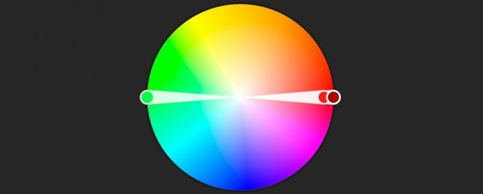
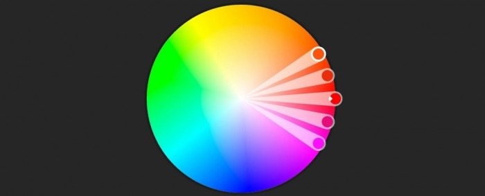
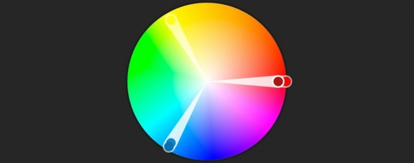
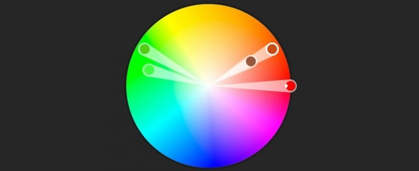

## 网页设计中隐藏在色彩之后的情感和心理学

> 译自 [The Psychology and Emotion Behind Color in Web Design](http://blogs.adobe.com/dreamweaver/2015/10/the-psychology-and-emotion-behind-color-in-web-design.html)

当我在2000年中旬的时候，还是一个非常糟糕的设计师。

讲真，都没法说了。

这并不是说我对于那个工具或者什么鬼的东西手足无措，而问题出在其他地方：

**颜色**

如果用一句话来总结我的缺点，那就是：我并不是为了要达成的目标或者网站所要吸引的用户而使用一些颜色，而是根据自己的个人喜好去用他们。

比如吧，亮绿色简直就是我绳命里的最爱，然后你猜猜发生了什么。。。我早期的设计生涯简直一片绿，就没其他东西了。

“hey我喜欢绿色人人都喜欢绿色，所以网站也得是绿色的！”---这真的不是一个运用颜色的好思路

但后来，我意识到，也许当你对网站进行设计的时候，需要对颜色的选择进行更深入的思考。那并不是一个三秒的头脑风暴就能决定的了的。它不像站点logo配色那样，而是一个更加完整和巨大的问题。更何况，颜色或许还是设计师最有效有力的一个工具

正如科学所证明的那样，颜色会引发特定的感情。你还可以瞅瞅[色彩与感情的关联](http://www.informationisbeautiful.net/visualizations/colours-in-cultures/)。

那么，如何找到一个适合你的(色彩设计)方法呢？如何为了达成一个目标，或是设计一个网站或者面向一些特定的用户群体，而正确的运用色彩呢？来来来让我们试着回答这些问题。

### Step #1.思考你的目标

对颜色的正确选择，要比选一个看起来还凑合的颜色，或者给网站定个品牌什么的要严肃的多。

当你有了一个目标或工作任务的时候，对于颜色的思考就已经开始了。

在大多数情况下，**网站的目标是为了转换--将用户拉的更近，以便提供进一步的服务**

因为，思考你的目标将会是一个好的开始。除此以外，也要思考你的目标所想要带来或引导的用户行为，例如：

  - 用户的行为依赖感情的响应吗
  - 或者用户的行为更易于估量，需要用户处于一个平静的状态中？
  - 这些转变能够带来money吗？在这个情景下（译者注：付钱的情景下），用户是否需要在当时的环境中感觉安全？
  - 用户的行为是意味着获得收益还是减少损失？
  - 当用户访问网站的时候，是否已经有了我们想要（他有）的情感？你是否想让他们继续保持在当前状态下？

当你回答完这些问题的时候，或许能够让你对用户感情状态有一个更好的见解。有了这个认知之后，你就可以使用各种工具来让用户处于正确的情感状态之下，或者至少让他们保持它。

### Step #2.理解你的受众

我们首先要铭记的是：

**色彩并不是普遍受用的**

这意味着，随着你受众的改变，比需要运用不同的颜色唤起不同的感情。颜色与人的关系受到很多因素的影响。地理位置，人文背景，宗教信仰，政治差异，当前发生的大事，这些都在其中扮演了一定的角色。

因此，请记住，弄清你所想要用户达成的感情状态只是问题的一般。另一半则是如何高效的引导用户达到那个状态上去。

最糟糕的方法是，依据自身的文化教育背景，使用自我感觉良好的颜色，而没有针对目标群体进行研究。如果你这么做了，那你成功的概率只能悲剧的依赖于用户群体和你自身重叠的概率了。

举个例子吧，使用绿色作为想要唤起用户行为的按钮的颜色，并不使用于全球范围内的用户。因为在一些南美文化中，绿色与死亡挂钩。

因此，首先请搜索你目标用户的文化背景/地理位置等信息与颜色之间的关联。

使用[信息图表](http://www.informationisbeautiful.net/visualizations/colours-in-cultures/)会是一个好的办法。这上面对于基础颜色和他们对不同文化的关联给出了很好的预览。另外这篇[Color and cultural design considerations](http://www.webdesignerdepot.com/2012/06/color-and-cultural-design-considerations/)也很赞。它对于色彩和文化的重要性进行了更深层次的讨论。

我应该对于我们的目标进行更精细的讨论与思考。此时此刻，你不再仅仅是找一个网站可以适用的颜色，而是依据你想吸引的用户的不同文化教育背景，寻找一套指导方针。基于这点，再去寻找可以唤醒特定情感的色彩。（你的网站目标所需要的用户情感）

### Step #3. 色彩面板以及如何使用

网页设计的一个难点是，你不能只使用一种颜色。有时候你得用一大把。

看看笔记里的上一步--你的指导方针需要设计传达高兴的情感--为此你可以探索色彩面板。这时，我会使用[Adobe’s Color Wheel](https://color.adobe.com/zh/create/color-wheel/)工具，它提供了很赞的UI和通用的色彩模板。例如：

#### 互补色

包含了两个相互对立的颜色。它会依据颜色的对立而形成鲜明的对比。

#### 同色系

同色系的颜色在色彩面板的相同颜色区域内。但它们在亮度方面成对比对立。

#### 三原色

色彩面板中的平衡。通常是最安全最易于使用的

#### 复合色

也叫作拆分互补色，通常由四种颜色组成--两对互补色。它比较难以使用

对于色彩面板如何运用的tip是，不要太陷入颜色选择的决策中。你应该从基础颜色开始--这个基础颜色是色彩面板的核心。之后，基于这个颜色之上开始构建色彩搭配--这时，可以使用Adobe’s Color Wheel

你所运用的核心色彩，应该与你想要唤醒的用户情感紧密关联。它应该成为你的主要工具--工作围绕着这个颜色完成。

之后，其他的颜色用来做一些其他小任务，来通过各种方式增强你的核心目标。

举个栗子（蓝色-主色调，黄色-辅助色）：

### Step #4.养头紫色的奶牛