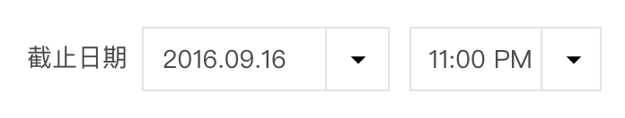
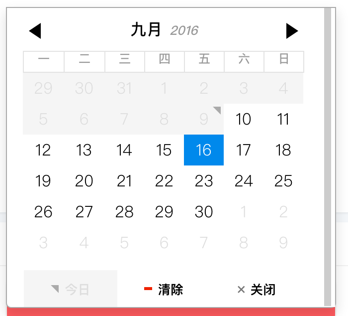
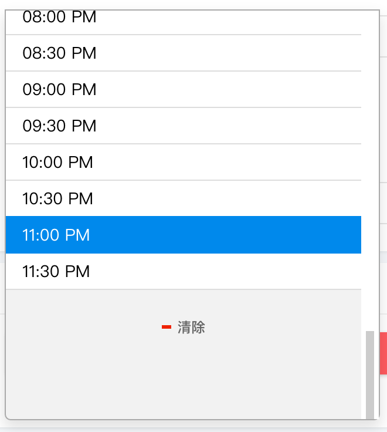
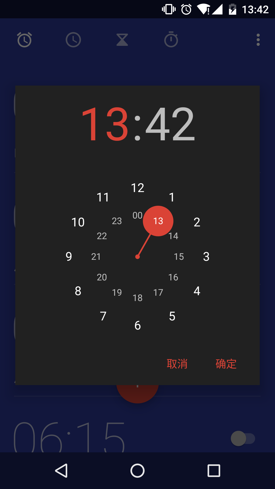
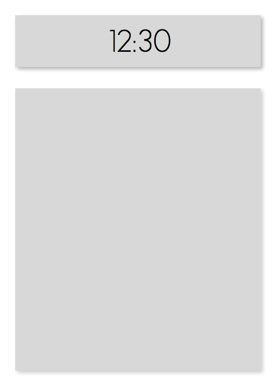
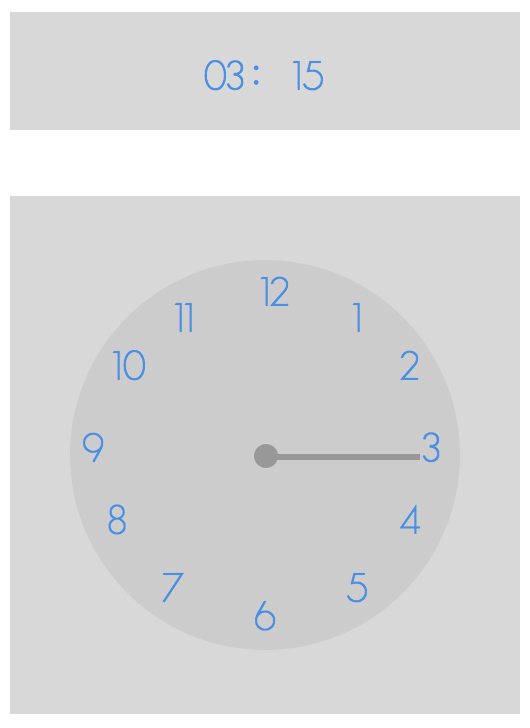
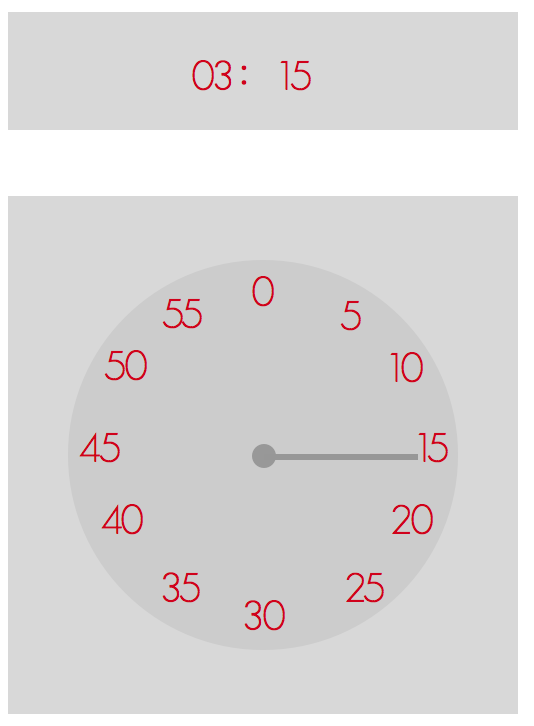
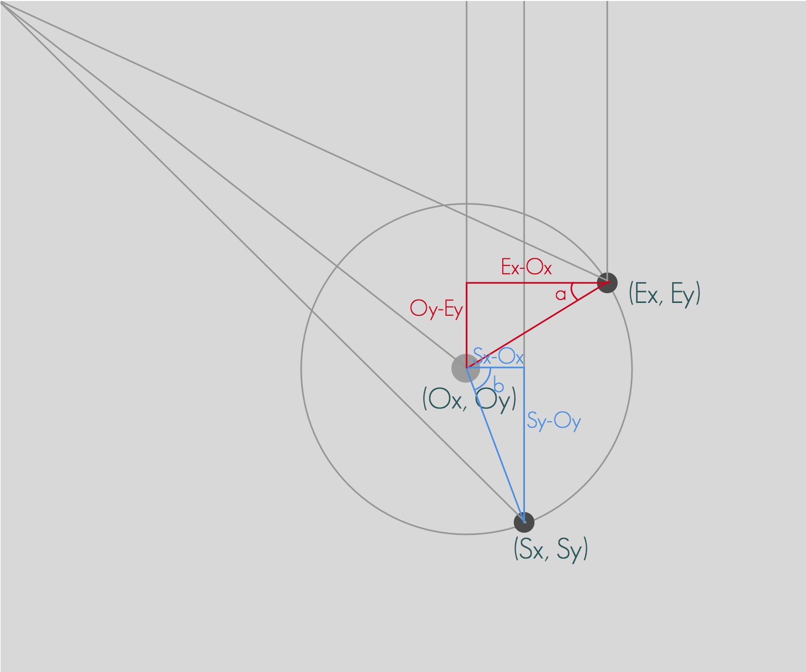

## 一言不合造轮子--撸一个ReactTimePicker

> 本文的源码全部位于github项目仓库[`react-times`](https://github.com/ecmadao/react-times)，如果有差异请以github为准。最终线上DEMO可见[react-times github page](https://ecmadao.github.io/react-times/)

> 文章记录了一次创建独立React组件并做成NPM包的过程，将会涉及到React开发、单页测试、Webpack等内容。

先看下最终的效果~


### 起因

因为我司的业务需求，需要有一个日期和时间的选择器。最开始我们使用的是[`pickadate`](http://amsul.ca/pickadate.js/)，一个基于jQuery的比较老牌的时间日期选择器。在页面上大致长这样：



这样：



还有这样：



大体上看着还OK吧？但是后来随着我们业务的增长和代码重构，前端webpack成为标配，同时越来越多的页面使用React进行重构，pickadata经常出现一些莫名的bug，再加上它本身的API不够`React Style` --- 在和React中使用的时候，pickadate组件的初始化还不得不按照老式的jQuery组件那样，调用API，在DOM里插入pickadate。而且，为了获取date/time变动时的值，往往需要通过jQuery选择器来拿到value，因而pickadate组件选择器的初始化和一些事件都较多的依赖于React Component的生命周期。这。。用久了就感觉越来越蛋疼了。

后来又一次偶尔发现了Airbnb（业界良心）开源的React组件--[`react-dates`](https://github.com/airbnb/react-dates)。

`react-dates`是一个基于`moment`和`React`的日期选择器，其插件本身就是一个ReactComponent，有NPM，有足够的测试，有良好的API。于是当即下定决心要趁此干掉pickadate。可真正用到项目中才发现它居然不支持时间选择！！！（或许因为Airbnb本身的业务就是更看重日期的？）因此才有了自己撸一个的想法。

### 设计与架构

#### UI设计

UI方面没得说，我是妥妥的`Material Design`党。这次也是着急动手撸代码，所以直接就参考Android6.0+系统上闹钟里的时间选择好了，之后再完善并增加UI主题：



目标差不多就长这个样子，再增加一个选择时间的按钮和黑白配色的选择。

#### 需求整理

搭配我们的“UI稿”和线框稿一起食用：



可以看到，除去上方选择时间并展示的按钮之外，我们把真正的时间表盘放在了下面的modal里。而modal表盘里的设计，则会模仿上图的Android时间选择器，是一个MD风格的拟时钟样式的选择器。初步整理出一些需求：

- 点击按钮弹出表盘modal，再点击其他区域关闭modal
- 表盘modal里有一个圆形的时间选择器，时间的数字围绕圆形环绕
- 表盘里有一个指针，可以以表盘为中心旋转
- 点击代表时间的数字，应该改变外层按钮里对应的小时/分钟，同时指针改变旋转角度，指向点击的时间
- 拖拽指针，可以环绕中心旋转。当放开指针时，它应该自动指向距离最近的小时或者分钟
- 拖拽指针并松开，指针停止之后，当前选择的时间和外层按钮上显示的时间应该被改变
- 拖拽指针到两个整数数字之间并放开时，指针应该自动旋转到距离最近的时间上

#### 代码设计

有了上面的初步需求整理，我们就可以来构思组件的代码设计了。既然是个React组件，那么就应该按照逻辑和UI，把整体尽可能的拆分成足够小的模块。

有几点代码层面的架构需要考虑：

- 考虑到“点击按钮弹出表盘modal，再点击其他区域关闭modal”这个需求，或许我们应该在分离出一个`OutsideClickHandler`，专门用来处理用户点击了表盘以外其他区域时的modal关闭事件。
- Android时间选择的表盘其实有两个，一个是小时的选择，另一个则是分钟的选择。用户可以点击modal里圆形表盘上的小时/分钟，来切换不同的表盘。那么这意味着或许会有大量的代码可供我们复用。

那么就先按照这个思路进行拆分：

- `TimePicker`
    + 按钮
    + 处理外层点击事件的组件（`OutsideClickHandler`）
    + 表盘modal
        + modal + 表盘（`TimePickerModal`）
        + 环绕的数字（`PickerPoint`）
        + 指针（`PickerDargHandler`）

在这样的结构下，`TimePicker.jsx`文件将是我们最后`export`出去的组件。在`TimePicker,jsx`中，包含了按钮组件和Modal组件。而Modal组件的各个组成部分被拆分成粒度更小的组件，以便组合和复用。

这样有哪些好处呢？举个栗子：

- 我们在做组件的时候，先做了小时的选择，然后做分钟的选择。但两个picker的UI不同点主要集中在数字在表盘的布局上，以及一些选择的代码逻辑。这样的话我们就可以保持大体框架不变，只改变表盘中心渲染的数字布局即可。

假设下图是小时选择器：（请原谅我可怜的绘图）



假设下图是分钟选择器：（请原谅我可怜的绘图）



- 而我们按照这样的架构撸完代码之后，如果想额外做一些其他的东西，比如支持12小时制，那么小时和分钟的选择则应该集中在一个表盘modal上（也就是长得和正常是时钟一样）。在这样的需求下，我们需要在一个表盘里同时渲染小时和分钟的数字布局，而其他的东西，比如说modal啊，指针啊依旧保持原样（一样的指针组件，只不过渲染了两个）。

下图是24小时制，点击modal上的小时/分钟来切换不同表盘：


下图是12小时制，在同一个表盘上显示小时和分钟：


#### 文件结构

So, 目前这样的结构设计应该可以满足我们的简单的需求。接下来就开始卷起袖子撸代码喽。

新建项目，文件结构如下：

```bash
# react-times
- src
    - components
        - TimePicker.jsx
        - OutsideClickHandler.jsx
        - TimePickerModal.jsx
        - PickerPoint.jsx
        - PickerDargHandler.jsx
    - utils.js
    - ConstValue.js
- css
- test
- lib
- index.js
- package.json
- webpack.config.js
```

其中，`src`文件夹下是我们的源码，而`lib`则是编译过后的代码。而`index.js`则是整个包最终的出口，我们在这里将做好的组件暴露出去：

```javascript
var TimePicker = require('./lib/components/TimePicker').default;

module.exports = TimePicker;
```

### 环境搭建

既然是写一个独立的React组件，那它的开发则和我们项目的开发相互独立。

那么问题来了：该如何搭建开发和测试环境呢？这个组件我想使用`React`和`ES6`的语法，而单元测试则使用`mocha`+`chai`和Airbnb的`enzyme`（再次感谢业界良心）。那么在发布之前，应该使用构建工具将其初步打包，针对于这点我选用了`webpack。

而在开发过程中，需要能够启动一个server，以便能在网页上渲染出组件，进行调试。因此，可以使用[`react-storybook`](https://github.com/kadirahq/react-storybook)这个库，它允许我们启动一个server，把自己的组件渲染在页面上，并支持webpack进行编译。具体的使用大家可以去看[storybook文档](https://getstorybook.io/)，非常简单易懂，便于配置。

那么进入正题，组件的编写。

### 组件编写

#### `TimePicker`

对于传入组件的`props`：

- `defaultTime`：默认初始化时间。默认为当前时间
- `focused`：初始化时modal是否打开。默认为`false`
- `onFocusChange`：modal开/关状态变化时的回调
- `onHourChange`：选择的小时变化时的回调，以小时作为参数
- `onMinuteChange`：选择的分钟变化时的回调，以分钟作为参数
- `onTimeChange`：任意时间变化时的回调，以`hour:minute`作为参数，参数类型是String

```javascript
// src/components/TimePicker.jsx
// 省略了一些方法的具体内容和组件属性的传递
import React, {PropTypes} from 'react';
import moment from 'moment';

import OutsideClickHandler from './OutsideClickHandler';
import TimePickerModal from './TimePickerModal';

// 组件开发要养成良好的习惯：检查传入的属性，并设定默认属性值
const propTypes = {
  defaultTime: PropTypes.string,
  focused: PropTypes.bool,
  onFocusChange: PropTypes.func,
  onHourChange: PropTypes.func,
  onMinuteChange: PropTypes.func,
  onTimeChange: PropTypes.func
};

const defaultProps = {
  defaultTime: moment().format("HH:mm"),
  focused: false,
  onFocusChange: () => {},
  onHourChange: () => {},
  onMinuteChange: () => {},
  onTimeChange: () => {}
};

export default class TimePicker extends React.Component {
  constructor(props) {
    super(props);
    let {defaultTime, focused} = props;
    let [hour, minute] = initialTime(defaultTime);
    this.state = {
      hour,
      minute,
      focused
    }
    this.onFocus = this.onFocus.bind(this);
    this.onClearFocus = this.onClearFocus.bind(this);
    this.handleHourChange = this.handleHourChange.bind(this);
    this.handleMinuteChange = this.handleMinuteChange.bind(this);
  }

  // 改变state，并触发onFocusChange callback
  onFocus() {}
  onClearFocus() {}
  handleHourChange() {}
  handleMinuteChange() {}

  renderTimePickerModal() {
    let {hour, minute, focused} = this.state;
    // 给组件传入小时/分钟，以及handleHourChange,handleMinuteChange
    return (
      <TimePickerModal />
    )
  }

  render() {
    let {hour, minute, focused} = this.state;
    let times = `${hour} : ${minute}`;
    return (
      <div className="time_picker_container">
        <div onClick={this.onFocus} className="time_picker_preview">
          <div className={previewContainerClass}>
            {times}
          </div>
        </div>
        {/*OutsideClickHandler 就是上面说到了，专门用于处理modal外点击事件，来关闭modal的组件*/}
        <OutsideClickHandler onOutsideClick={this.onClearFocus}>
          {this.renderTimePickerModal()}
        </OutsideClickHandler>
      </div>
    )
  }
}

TimePicker.propTypes = propTypes;
TimePicker.defaultProps = defaultProps;
```

可以看到，`OutsideClickHandler`包裹着`TimePickerModal`，而在`OutsideClickHandler`中，我们进行modal外点击事件的处理，关闭modal

#### `OutsideClickHandler`

```javascript
// src/components/OutsideClickHandler.jsx

// ...

const propTypes = {
  children: PropTypes.node,
  onOutsideClick: PropTypes.func,
};

const defaultProps = {
  children: <span />,
  onOutsideClick: () => {},
};

export default class OutsideClickHandler extends React.Component {
  constructor(props) {
    super(props);
    this.onOutsideClick = this.onOutsideClick.bind(this);
  }

  componentDidMount() {
    // 组件didMount之后，直接在document上绑定点击事件监听
    if (document.addEventListener) {
      document.addEventListener('click', this.onOutsideClick, true);
    } else {
      document.attachEvent('onclick', this.onOutsideClick);
    }
  }

  componentWillUnmount() {
    if (document.removeEventListener) {
      document.removeEventListener('click', this.onOutsideClick, true);
    } else {
      document.detachEvent('onclick', this.onOutsideClick);
    }
  }

  onOutsideClick(e) {
    // 如果点击区域不在该组件内部，则调用关闭modal的方法
    // 通过ReactDOM.findDOMNode来拿到原生的DOM，避免额外的jQuery依赖
    const isDescendantOfRoot = ReactDOM.findDOMNode(this.childNode).contains(e.target);
    if (!isDescendantOfRoot) {
      let {onOutsideClick} = this.props;
      onOutsideClick && onOutsideClick(e);
    }
  }

  render() {
    return (
      <div ref={(c) => this.childNode = c}>
        {this.props.children}
      </div>
    )
  }
}

OutsideClickHandler.propTypes = propTypes;
OutsideClickHandler.defaultProps = defaultProps;
```

#### `TimePickerModal`

而`TimePickerModal`主要用来渲染`PickerDargHandler`和`PickerPoint`组件：

```javascript
// src/components/TimePickerModal.jsx
// ...
// 为了简便我们在文章中忽略引入的React和一些参数类型检查

class TimePickerModal extends React.Component {
  constructor(props) {
    super(props);
    /*
    - 获取初始化时的旋转角度
    - 以step 0代表hour的选择，1代表minute的选择
    */
    let pointerRotate = this.resetHourDegree();
    this.state = {
      step: 0,
      pointerRotate
    }
  }

  handleStepChange(step) {}

  handleTimePointerClick(time, pointerRotate) {
    /*
    - 当表盘上某一个数字被点击时
    - 或者拖拽完指针并放下时，所调用的回调
    - 参数是该数字或指针所代表的时间和旋转角度
    */
  }

  // 在切换step的时候，根据当前的hour/minute来重新改变旋转角度
  resetHourDegree() {}
  resetMinuteDegree() {}

  /*
  + 两个方法会return PickerPoint组件
  + 之所以分两个是因为小时/分钟表盘在UI上有较多不同，因而传入的props需要不同的计算
  + 但在PickerPoint组件内部的逻辑是一样的
  */
  renderMinutePointes() {}
  renderHourPointes() {}

  render() {
    let {step, pointerRotate} = this.state;
    return (
      <div className="time_picker_modal_container">
        <div className="time_picker_modal_header">
          <span onClick={this.handleStepChange.bind(this, 0)}>
            {hour}
          </span>
          &nbsp;:&nbsp;
          <span onClick={this.handleStepChange.bind(this, 1)}>
            {minute}
          </span>
        </div>
        <div className="picker_container">
          {step === 0 ? this.renderHourPointes() : this.renderMinutePointes()}
          <PickerDargHandler
              pointerRotate={pointerRotate}
              time={step === 0 ? parseInt(hour) : parseInt(minute)}
              handleTimePointerClick={this.handleTimePointerClick} />
        </div>
      </div>
    )
  }
}
```

#### `PickerPoint`

`PickerPoint`内的逻辑很简单，就是渲染数字，并处理点击事件：

```javascript
// src/components/PickerPoint.jsx
// ...

const propTypes = {
  index: PropTypes.number,
  angle: PropTypes.number,
  handleTimeChange: PropTypes.func
};

class PickerPoint extends React.Component {
  render() {
    let {index, handleTimeChange, angle} = this.props;
    let inlineStyle = getInlineRotateStyle(angle);
    let wrapperStyle = getRotateStyle(-angle);

    return (
      <div
        style={inlineStyle}
        onClick={() => {
          handleTimeChange(index, angle)
        }}
        onMouseDown={disableMouseDown}>
        <div className="point_wrapper" style={wrapperStyle}>
          {index}
        </div>
      </div>
    )
  }
}
```

#### `PickerDargHandler`

在`PickerDargHandler`组件里，我们主要处理指针的拖拽事件，并将处理好的结果通过callback向上传递。

在这个组件里，它拥有自己的state：

```javascript
this.state = {
  pointerRotate: this.props.pointerRotate,
  draging: false
}
```

其中，`pointerRotate`是从父层传入，用来给组件初始化时定位指针的位置。而`draging`则用于处理拖拽事件，标记着当前是否处于被拖拽状态。

对于拖拽事件的处理，大致思路如下：

先写一个获取坐标位置的util：

```javascript
export const mousePosition = (e) => {
  let xPos, yPos;
  e = e || window.event;
  if (e.pageX) {
    xPos = e.pageX;
    yPos = e.pageY;
  } else {
    xPos = e.clientX + document.body.scrollLeft - document.body.clientLeft;
    yPos = e.clientY + document.body.scrollTop - document.body.clientTop;
  }
  return {
    x: xPos,
    y: yPos
  }
};
```

然后需要明确的是，我们在处理拖拽事件过程中，需要记录的数据有：

- `this.originX`/`this.originY` 旋转所环绕的中心坐标。在`componentDidMount`事件中记录并保存
- `this.startX`/`this.startY` 每次拖拽事件开始时的坐标。在`onMouseDown`事件中记录并保存
- `dragX`/`dragY` 移动过程中的坐标，随着移动而不断改变。在`onMouseMove`事件中记录并保存
- `endX`/`endY` 移动结束时的坐标。在`onMouseUp`事件中进行处理，并获取最后的角度degree，算出指针停止时对准的时间time，并将time和degree通过callback向父层组件传递。

```javascript
// 处理onMouseDown
handleMouseDown(e) {
  let event = e || window.event;
  event.preventDefault();
  event.stopPropagation();
  // 在鼠标按下的时候，将draging state标记为true，以便在移动时对坐标进行记录
  this.setState({
    draging: true
  });

  // 获取此时的坐标位置，作为这次拖拽的开始位置保存下来
  let pos = mousePosition(event);
  this.startX = pos.x;
  this.startY = pos.y;
}
```

```javascript
// 处理onMouseMove
handleMouseMove(e) {
  if (this.state.draging) {
    // 实时获取更新当前坐标，用于计算旋转角度，来更新state中的pointerRotate，而pointerRotate用来改变渲染的视图
    let pos = mousePosition(e);
    let dragX = pos.x;
    let dragY = pos.y;

    if (this.originX !== dragX && this.originY !== dragY) {
      // 获取旋转的弧度。getRadian方法在下面讲解
      let sRad = this.getRadian(dragX, dragY);
      // 将弧度转为角度
      let pointerRotate = sRad * (360 / (2 * Math.PI));
      this.setState({
        // 记录下来的state会改变渲染出来的指针角度
        pointerRotate
      });
    }
  }
}
```

在`getRadian`方法中，通过起始点和中心点的坐标来计算旋转结束后的弧度：

```javascript
getRadian(x, y) {
  let sRad = Math.atan2(y - this.originY, x - this.originX);
  sRad -= Math.atan2(this.startY - this.originY, this.startX - this.originX);
  sRad += degree2Radian(this.props.rotateState.pointerRotate);
  return sRad;
}
```

`Math.atan2(y, x)`方法返回从x轴到点(x, y)的弧度，介于 -PI/2 与 PI/2 之间。

因此这个计算方法直接上图表示，清晰明了：



```javascript
// 处理onMouseUp
handleMouseUp(e) {
  if (this.state.draging) {
    this.setState({
      draging: false
    });

    // 获取结束时的坐标
    let pos = mousePosition(e);
    let endX = pos.x;
    let endY = pos.y;

    let sRad = this.getRadian(endX, endY);
    let degree = sRad * (360 / (2 * Math.PI));

    // 在停止拖拽时，要求指针要对准表盘的刻度。因此，除了要对角度的正负进行处理以外，还对其四舍五入。最终获取的pointerRotate是对准了刻度的角度。
    if (degree < 0) {
      degree = 360 + degree;
    }
    // roundSeg是四舍五入之后的对准的表盘上的时间数字
    let roundSeg = Math.round(degree / (360 / 12));
    let pointerRotate = roundSeg * (360 / 12);

    // 分钟表盘的每一格都是小时表盘的5倍
    let time = step === 0 ? time : time * 5;
    // 将结果回调给父组件
    let {handleTimePointerClick} = this.props;
    handleTimePointerClick && handleTimePointerClick(time, pointerRotate);
  }
}
```

你可能注意到只有在`onMouseUp`的最后，我们才把计算得到的角度回调到父组件里，，改变父组件的state。而在`handleMouseMove`方法里，我们只把角度存在当前state里。那是因为在每次移动过程中，都需要知道每次开始移动时的角度偏移量。这个数值我们是从父组件state里拿到的，因此只有在放手时才会更新它。而`PickerDargHandler`组件内部存的state，只是用来在拖拽的过程中改变，以便渲染指针UI的旋转角度：

```javascript
componentDidUpdate(prevProps) {
  let {step, time, pointerRotate} = this.props;
  let prevStep = prevProps.step;
  let prevTime = prevProps.time;
  let PrevRotateState = prevProps.pointerRotate
  if (step !== prevStep || time !== prevTime || pointerRotate !== PrevRotateState) {
    this.resetState();
  }
}
```

而这些方法，会在组件初始化时绑定，在卸载时取消绑定：

```javascript
componentDidMount() {
  // 记录中心坐标
  if (!this.originX) {
    let centerPoint = ReactDOM.findDOMNode(this.refs.pickerCenter);
    let centerPointPos = centerPoint.getBoundingClientRect();
    this.originX = centerPointPos.left;
    this.originY = centerPointPos.top;
  }
  // 把handleMouseMove和handleMouseUp绑定在document，这样即使鼠标移动时不在指针或者modal上，也能够继续响应移动事件
  if (document.addEventListener) {
    document.addEventListener('mousemove', this.handleMouseMove, true);
    document.addEventListener('mouseup', this.handleMouseUp, true);
  } else {
    document.attachEvent('onmousemove', this.handleMouseMove);
    document.attachEvent('onmouseup', this.handleMouseUp);
  }
}

componentWillUnmount() {
  if (document.removeEventListener) {
    document.removeEventListener('mousemove', this.handleMouseMove, true);
    document.removeEventListener('mouseup', this.handleMouseUp, true);
  } else {
    document.detachEvent('onmousemove', this.handleMouseMove);
    document.detachEvent('onmouseup', this.handleMouseUp);
  }
}
```

最后看一眼render方法：

```javascript
render() {
  let {time} = this.props;
  let {draging, height, top, pointerRotate} = this.state;
  let pickerPointerClass = draging ? "picker_pointer" : "picker_pointer animation";

  // handleMouseDown事件绑定在了“.pointer_drag”上，它位于指针最顶端的位置
  return (
    <div className="picker_handler">
      <div
        ref={(d) => this.dragPointer = d}
        className={pickerPointerClass}
        style={getInitialPointerStyle(height, top, pointerRotate)}>
        <div
          className="pointer_drag"
          style={getRotateStyle(-pointerRotate)}
          onMouseDown={this.handleMouseDown}>{time}</div>
      </div>
      <div
        className="picker_center"
        ref={(p) => this.pickerCenter = p}></div>
    </div>
  )
}
```

> 至此，我们的工作就已经完成了（才没有）。其实除了控制旋转角度以外，还有指针的坐标、长度等需要进行计算和控制。但即便完成这些，离一个合格的NPM包还有一段距离。除了基本的代码编写，我们还需要有单元测试，需要对包进行编译和发布。

### 测试

> 关于更多的React测试介绍，可以戳这两篇文章入个门：
> 
> [UI Testing in React](https://voice.kadira.io/ui-testing-in-react-74fd90a5d58b)
> 
> [React Unit Testing with Mocha and Enzyme](https://medium.freecodecamp.com/react-unit-testing-with-mocha-and-enzyme-77d18b6875cb)

使用`mocha`+`chai`和`enzyme`来进行React组件的单元测试：

```bash
$ npm i mocha --save-dev
$ npm i chai --save-dev
$ npm i enzyme --save-dev
$ npm i react-addons-test-utils --save-dev

# 除此之外，为了模拟React中的事件，还需要安装：
$ npm i sinon --save-dev
$ npm i sinon-sandbox --save-dev
```

然后配置`package.json`：

```json
"scripts": {
  "mocha": "./node_modules/mocha/bin/mocha --compilers js:babel-register,jsx:babel-register",
  "test": "npm run mocha test"
}
```

请注意，为了能够检查ES6和React，确保自己安装了需要的babel插件：

```bash
$ npm i babel-register --save-dev
$ npm i babel-preset-react --save-dev
$ npm i babel-preset-es2015 --save-dev
```

并在项目根目录下配置了`.babelrc`文件：

```
{
  "presets": ["react", "es2015"]
}
```

然后在项目根目录下新建`test`文件夹，开始编写测试。

编写`TimePicker`组件的测试：

```javascript
// test/TimePicker_init_spec.jsx

import React from 'react';
import {expect} from 'chai';
import {shallow} from 'enzyme';
import moment from 'moment';

import OutsideClickHandler from '../../src/components/OutsideClickHandler';
import TimePickerModal from '../../src/components/TimePickerModal';

describe('TimePicker initial', () => {
  it('should be wrappered by div.time_picker_container', () => {
    // 检查组件是否被正确的渲染。期待检测到组件最外层div的class
    const wrapper = shallow(<TimePicker />);
    expect(wrapper.is('.time_picker_container')).to.equal(true);
  });

  it('renders an OutsideClickHandler', () => {
    // 期待渲染出来的组件中含有OutsideClickHandler组件
    const wrapper = shallow(<TimePicker />);
    expect(wrapper.find(OutsideClickHandler)).to.have.lengthOf(1);
  });

  it('should rendered with default time in child props', () => {
    // 提供默认time，期待TimePickerModal能够获取正确的hour和minute
    const wrapper = shallow(<TimePicker defaultTime="22:23" />);
    expect(wrapper.find(TimePickerModal).props().hour).to.equal("22");
    expect(wrapper.find(TimePickerModal).props().minute).to.equal("23");
  });

  it('should rendered with current time in child props', () => {
    // 在没有默认时间的情况下，期待TimePickerModal获取的hour和minute与当前的小时和分钟相同
    const wrapper = shallow(<TimePicker />);
    const [hour, minute] = moment().format("HH:mm").split(':');
    expect(wrapper.find(TimePickerModal).props().hour).to.equal(hour);
    expect(wrapper.find(TimePickerModal).props().minute).to.equal(minute);
  });
})
```

```javascript
// test/TimePicker_func_spec.jsx
import React from 'react';
import {expect} from 'chai';
import {shallow} from 'enzyme';
import sinon from 'sinon-sandbox';
import TimePicker from '../../src/components/TimePicker';

describe('handle focus change func', () => {
  it('should focus', () => {
    const wrapper = shallow(<TimePicker />);
    // 通过wrapper.instance()获取组件实例
    // 并调用了它的方法onFocus，并期待该方法能够改变组件的focused状态
    wrapper.instance().onFocus();
    expect(wrapper.state().focused).to.equal(true);
  });

  it('should change callback when hour change', () => {
    // 给组件传入onHourChangeStub方法作为onHourChange时的回调
    // 之后手动调用onHourChange方法，并期待onHourChangeStub方法被调用了一次
    const onHourChangeStub = sinon.stub();
    const wrapper = shallow(<TimePicker onHourChange={onHourChangeStub}/ />);
    wrapper.instance().handleHourChange(1);
    expect(onHourChangeStub.callCount).to.equal(1);
  });
})
```

### 编译

如同上面所说，我最后选用的是当今最火的`webpack`同学来编译我们的代码。相信`React`加`ES6`的webpack编译配置大家已经配烦了，其基本的loader也就是`babel-loader`了：

```javascript
const webpack = require('webpack');

// 通过node的方法遍历src文件夹，来组成所有的webpack entry
const path = require('path');
const fs = require('fs');
const srcFolder = path.join(__dirname, 'src', 'components');
// 读取./src/components/文件夹下的所有文件
const components = fs.readdirSync(srcFolder);

// 把文件存在entries中，作为webpack编译的入口
const files = [];
const entries = {};
components.forEach(component => {
  const name = component.split('.')[0];
  if (name) {
    const file = `./src/components/${name}`;
    files.push(file);
    entries[name] = file;
  }
});

module.exports = {
  entry: entries,
  output: {
    filename: '[name].js',
    path: './lib/components/',
    // 模块化风格为commonjs2
    libraryTarget: 'commonjs2',
  },
  module: {
    loaders: [
      {
        test: /\.jsx?$/,
        exclude: /(node_modules)/,
        include: path.join(__dirname, 'src'),
        loader: ["babel-loader"],
        query: {
          presets: ["react", "es2015"]
        }
      }
    ],
  },
  resolve: {
    extensions: ['', '.js', '.jsx'],
  },
  plugins: [
    new webpack.optimize.UglifyJsPlugin({
      compress: {
          warnings: false
      }
    }),
    new webpack.optimize.OccurenceOrderPlugin(),
    new webpack.DefinePlugin({
      'process.env.NODE_ENV': '"production"'
    }),
    new webpack.NoErrorsPlugin()
  ]
};
```

但有一个很重要很重要的问题需要说明一下：

编译过React组件的人都应该知道，React打包进代码里是比较大的（即便在Production+UglifyJsPlugin的情况下），更何况，我们这个组件作为独立的`node_module`包，不应该把React打包进去，因为：

1. 打包React之后会让组件文件体积增大数倍
2. 打包React之后，安装这个组件的用户会出现“重复安装React”的严重bug

因此，我们在打包的时候应该将第三方依赖独立出去，这就需要配置`webpack`的`externals`：

```javascript
externals(context, request, callback) {
  if (files.indexOf(request) > -1) {
    return callback(null, false);
  }
  return callback(null, true);
},
```

什么意思呢？你可以看[webpack externals官方文档](https://webpack.github.io/docs/configuration.html#externals)。鉴于`webpack`文档一般都很烂，我来大致解释一下：

在配置`externals`的时候，可以把它作为一个要复写的function：

> 官方栗子

```javascript
// request是webpack在打包过程中要处理了某一个依赖，无论是自己写的文件之间的相互引用，还是对第三方包的引用，都会将这次引用作为request参数，走这个方法
// callback接收两个参数，error和result
// 当result返回true或者一个String的时候，webpack就不会把这个request依赖编译到文件里去。而返回false则会正常编译
// 因此，我们在每次依赖调用的时候，通过这个方法来判断，某些依赖是否应该编译进文件里
function(context, request, callback) {
  // Every module prefixed with "global-" becomes external
  // "global-abc" -> abc
  if(/^global-/.test(request))
      return callback(null, "var " + request.substr(7));
  callback();
}
```
所以，就可以解释一下我们自己在webpack配置中的`externals`：

```javascript
externals(context, request, callback) {
  // 如果这个依赖存在于files中，也就是在./src/components/文件夹下，说明这是我们自己编写的文件，妥妥的要打包
  if (files.indexOf(request) > -1) {
    return callback(null, false);
  }
  // 否则他就是第三方依赖，独立出去不打包，而是期待使用了该组件的用户自己去打包React
  return callback(null, true);
},
```

至此，这个组件的编写可以告一段落了。之后要做的就是NPM包发布的事情。本来想一次性把这个也说了的，但是鉴于有更详细的文章在，大家可以参考[前端扫盲-之打造一个Node命令行工具](https://www.awesomes.cn/source/12)来学习Node包创建和发布的过程。

> 本文的源码全部位于github项目仓库[`react-times`](https://github.com/ecmadao/react-times)，如果有差异请以github为准。最终线上DEMO可见[react-times github page](https://ecmadao.github.io/react-times/)
> 
> 转载请注明来源：
> 
> ecmadao，https://github.com/ecmadao/Coding-Guide/tree/master/Notes/React/ReactJS