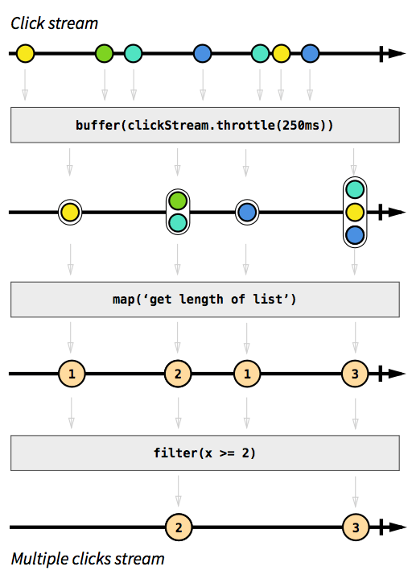
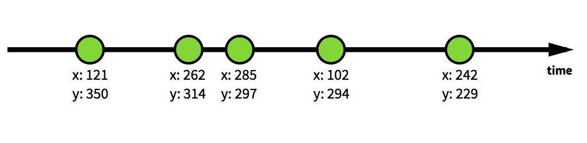
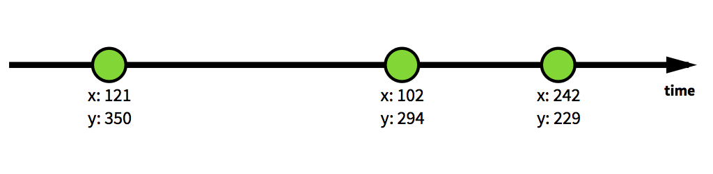
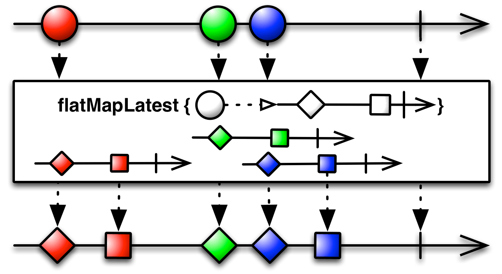

<!-- START doctoc generated TOC please keep comment here to allow auto update -->
<!-- DON'T EDIT THIS SECTION, INSTEAD RE-RUN doctoc TO UPDATE -->
**Table of Contents**  *generated with [DocToc](https://github.com/thlorenz/doctoc)*

- [探索 RxJS - Core Concept](#%E6%8E%A2%E7%B4%A2-rxjs---core-concept)
  - [Steam in ReactiveX](#steam-in-reactivex)
  - [Quick Intro](#quick-intro)
  - [运用场景](#%E8%BF%90%E7%94%A8%E5%9C%BA%E6%99%AF)
    - [含有异步请求和事件触发的混合流](#%E5%90%AB%E6%9C%89%E5%BC%82%E6%AD%A5%E8%AF%B7%E6%B1%82%E5%92%8C%E4%BA%8B%E4%BB%B6%E8%A7%A6%E5%8F%91%E7%9A%84%E6%B7%B7%E5%90%88%E6%B5%81)

<!-- END doctoc generated TOC please keep comment here to allow auto update -->

## 探索 RxJS - Core Concept

### Steam in ReactiveX


ReactiveX，又称 Reactive Extensions（响应式扩展），其中的 X 代表各种语言。因为它实质上只是一个事件流处理库，不需要什么其他依赖。

---

讲一讲 ReactiveX 中的 “流”：

我的理解是，Rx 通过 “流” 的概念，将事件串联成一个个事件流，各个事件流之间还可进行 "并联" 的作用。当某个流上的事件被调用时，就可以触发我们设定好的监听回调。

那么什么样的事件可以成为流呢？答案是任何事件。无论是异步非阻塞事件（setTimeOut、网络请求等），还是同步可阻塞事件（点击事件、对迭代器的遍历等），一切都是流。此时不得不盗一张图：


事件的串联就是流。比方说，用户对一个按钮进行了猛烈的点击，所有的点击事件就是一个流；再或者，并发多个网络请求，它们也是一个流。而 Rx 的主要作用，就是为流的处理提供了一整套的解决方案：将不同的流进行组合，或者监听事件的触发及时给予响应等等。

### Quick Intro

RxJS 的作者曾在 [The introduction to Reactive Programming you've been missing](https://gist.github.com/staltz/868e7e9bc2a7b8c1f754) 一文中详细讲解了 RxJS 的初步使用和流的概念，我们先仅看文中的一幅图来理解 Rx 的概念：



这是一个多次点击事件形成的事件流，在从左往右的时间线上有很多个点击事件，而每个点击事件的时间间隔各不相同。通过 Rx 我们可以对流上的各个事件进行筛选，并获取到在某一段时间内的连续点击次数。

作者自己吐槽过那篇文章实在太长，所以又有了后来的这篇 [2 minute introduction to Rx](https://medium.com/@andrestaltz/2-minute-introduction-to-rx-24c8ca793877) 文章。在文章中有如下解释：

我们在页面上的点击事件就可以组成流。比如一个记录每次点击时坐标的流。随机点击页面多次之后，可能会产生这样一个流：



而我们可以通过 RxJS 中的方法对这个流内的各个事件进行筛选，比如选出横坐标 x < 250 的点击：

```javascript
filter( (event) -> event.x < 250 )
```



也就是说，我们可以像对待 JavaScript 中可遍历对象一样，对流上的各个事件进行遍历，选出符合条件的事件。这就是 Rx 的魅力所在。

### 运用场景

既然 Rx 是为了流而生的，那么最佳运用场景当然是面对一系列较复杂的事件流时了。

#### 含有异步请求和事件触发的混合流

比如，用户在一个 input 内输入文字。每次`keyup`的时候就会根据输入内容，请求 Wikipedia 的 API 进行搜索：

```javascript
var input = document.getElementById('input');
var dictionarySuggest = Rx.Observable.fromEvent(input, 'keyup')
  .map(function () { return input.value; })
  .filter(function (text) { return !!text; })
  .distinctUntilChanged()
  .debounce(250)
  .flatMapLatest(searchWikipedia)
  .subscribe(
    function (results) {
      list = [];
      list.concat(results.map(createItem));
    },
    function (err) {
      logError(err);
    }
  );
```

我们创建了一个流来处理从用户`keyup`，到`searchWikipedia`，再到处理网络请求结果这一系列事件，并且在其中对事件进行了筛选判断：

- `filter` 剔除掉不合法的值
- [`distinctUntilChanged`](https://github.com/Reactive-Extensions/RxJS/blob/master/doc/api/core/operators/distinctuntilchanged.md) 当用户按下例如 左、右 这种按钮时，不会改变 input 的值，但也会触发`keyup`事件。这种时候就完全没有必要重复发送异步请求了。`distinctUntilChanged`会剔除流中有着相同的值的元素
- [`debounce`](https://github.com/Reactive-Extensions/RxJS/blob/master/doc/api/core/operators/debounce.md) 在过了一段指定的时间还没触发事件时才触发下一个事件。也就是说，在打字过程中，如果用户在指定事件间隔（250ms）内没有再打字，则触发下一个事件（searchWikipedia）；否则我们认为用户在连续打字，所以不会频繁的发送网络请求
- [`flatMapLatest`](http://reactivex.io/documentation/operators/flatmap.html)
  - 首先，它是一个`flatMap`方法。它用一个指定的函数（searchWikipedia）对原始流中的每一项数据执行变换操作，并返回一个`Observable`，`flatMap`将所有的返回值组成一个新的流。
  - 其次，`flatMapLatest`拥有`flatMap`的全部特性。但不同的是，在`flatMapLatest`的遍历调用过程中，如果一个事件 A 还没有触发完毕获取到返回值，就触发了下一个事件 B，则将忽略 A 返回的值。这样，我们就可以**避免 A 异步的返回值因为返回较慢，反而覆盖了之后 B 异步的返回值**。用图解释如下：



而在传统的编写方法里，我们可能会创建 input 的`keyup`监听事件，并缓存上一次的值；每次`keyup`时，要判断当前值是否合法，并且与上一次的值不一样。除此以外，还要创建一个定时器，每隔一段时间就用合法的值去请求`searchWikipedia`方法 --- 即便这样，也无法保证不在用户连续打字时发送请求。

可以看到，在我们把事件串成流并进行处理之后，要比传统的编写方式方便很多。