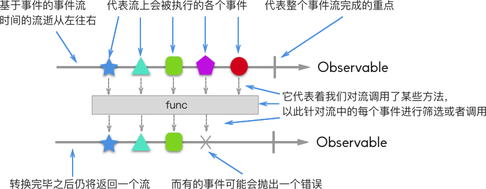
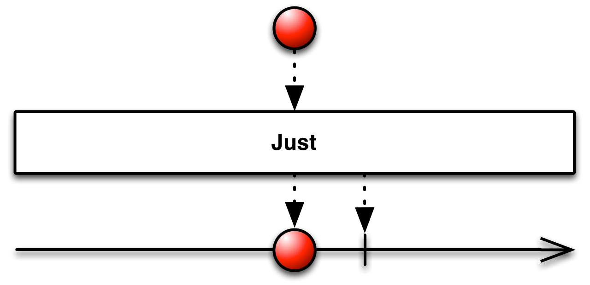
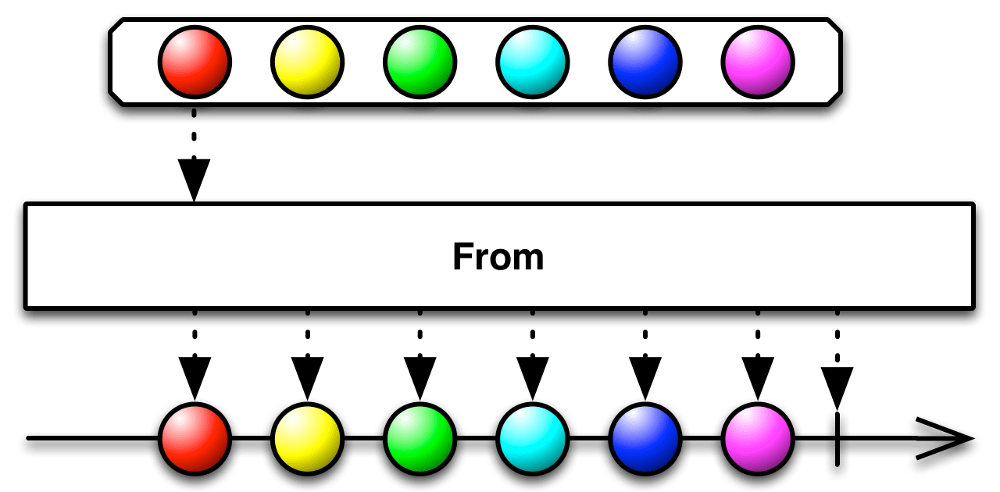
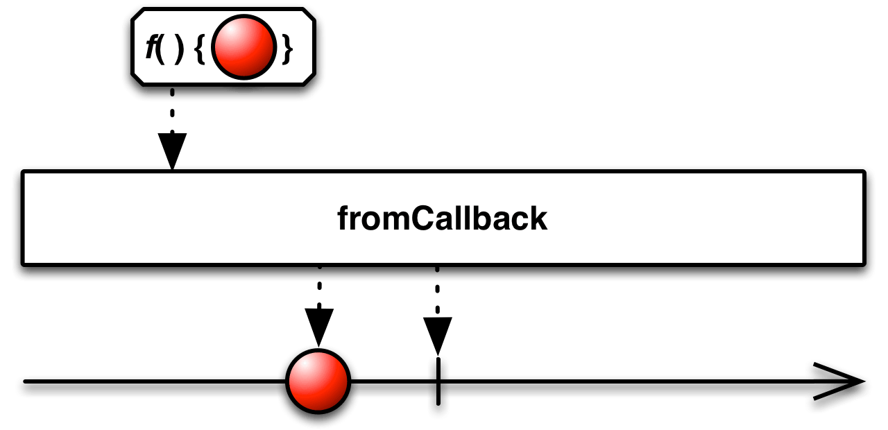
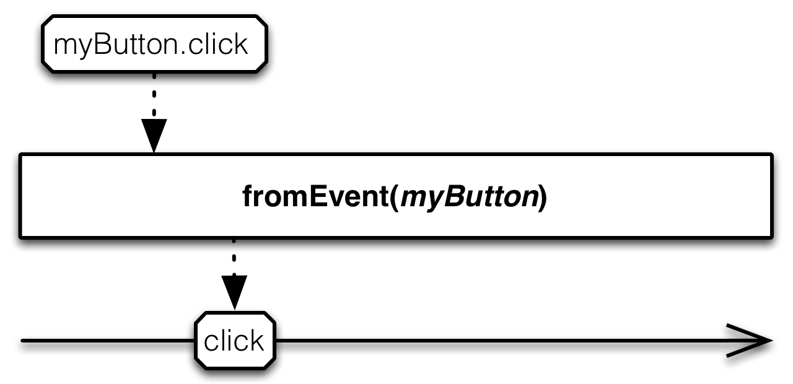
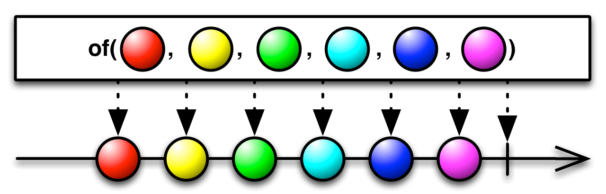
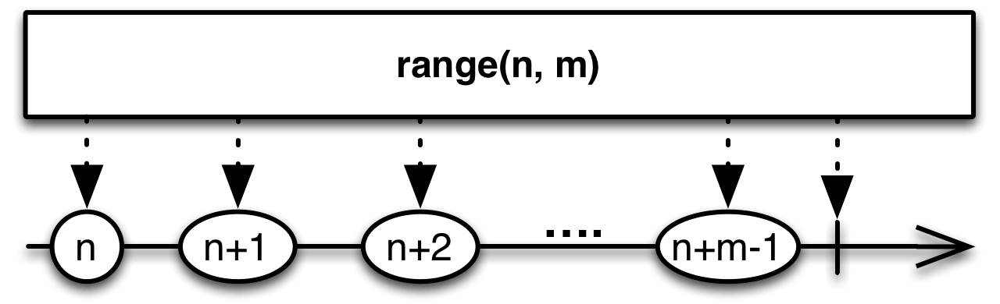
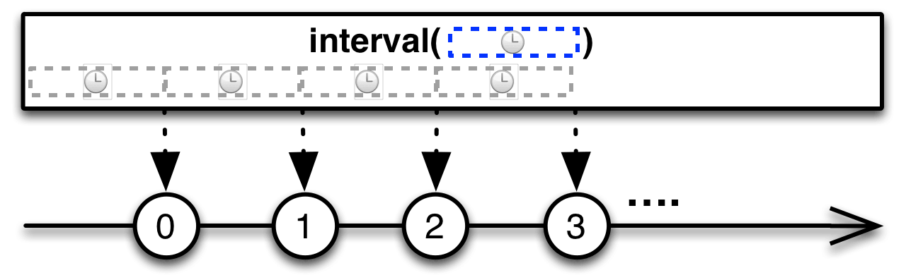

<!-- START doctoc generated TOC please keep comment here to allow auto update -->
<!-- DON'T EDIT THIS SECTION, INSTEAD RE-RUN doctoc TO UPDATE -->
**Table of Contents**  *generated with [DocToc](https://github.com/thlorenz/doctoc)*

- [探索 RxJS - Observable](#%E6%8E%A2%E7%B4%A2-rxjs---observable)
  - [`Observable`是什么？](#observable%E6%98%AF%E4%BB%80%E4%B9%88%EF%BC%9F)
  - [`Pull`&`Push`](#pull&push)
  - [进一步理解`Observable`](#%E8%BF%9B%E4%B8%80%E6%AD%A5%E7%90%86%E8%A7%A3observable)
  - [创建`Observable`](#%E5%88%9B%E5%BB%BAobservable)
  - [监听`Observable`](#%E7%9B%91%E5%90%ACobservable)
  - [流`Observable`的操作](#%E6%B5%81observable%E7%9A%84%E6%93%8D%E4%BD%9C)

<!-- END doctoc generated TOC please keep comment here to allow auto update -->

## 探索 RxJS - Observable

### `Observable`是什么？

官方的解释：

> The Observable object represents a push based collection.
>
> The Observer and Observable interfaces provide a generalized mechanism for push-based notification, also known as the observer design pattern. The Observable object represents the object that sends notifications (the provider); the Observer object represents the class that receives them (the observer).

也就是说，一个`Observable`类似一个集合或者说队列，用于表示一串的事件流。而观察者`Observer`注册监听`Observable`事件流上事件的触发。正因如此，`Observable`中的每个元素都是`push`属性的，即发生变化之后主动向外更新状态。

用一个表格来表示：

|      | 单一数据     | 大量数据           |
| ---- | -------- | -------------- |
| Pull | Function | Iterator(Array |
| Push | Promise  | Observable     |

### `Pull`&`Push`

`Pull`和`Push`是 “数据提供者” 和 ”数据消费者“ 之间的沟通协议。

|      | 数据提供者          | 数据消费者          |
| ---- | -------------- | -------------- |
| Pull | 被动：只有被调用时才提供数据 | 主动：决定什么时候需要数据  |
| Push | 主动：自主决定何时提供数据  | 被动：根据数据的变化进行反应 |

- `Pull`

对于`Pull`系统而言，由 ”数据消费者“ 来决定什么时候从 ”数据提供者“ 那里获取数据，而 ”数据提供者“ 本身并不知道什么时候把数据传递给消费者（提供者只有被动的调用之后才会传递数据）

JavaScript 中的函数`Function`和迭代器`Iterator`都是`Pull`类型的对象，它们只有被调用之后才会返回数据给消费者。对于`Function`而言，调用函数的代码就是消费者；而对于`Iterator`而言，调用`iterator.next()`的代码是消费者。

- `Push`

在`Push`系统中，”数据提供者“ 决定了何时提供数据给 ”数据消费者“，而消费者并不知道数据什么时候会传输过来。

`Promise`是`Push`系统的典型代表。它（`Promise`，数据提供者）将异步完成之后的数据提供给回调函数（`Callback`，数据消费者）

`RxJS`中的`Observable`也是 JavaScript 中的一种`Push`系统。一个`Observable`，也就是一串事件流，涵盖了多种/多个事件，因此是复数数据的提供者，将数据传输给观察者`Observers`（数据消费者）

### 进一步理解`Observable`

- 监听一个流类似于调用一个方法

`Observable`和`Function`有一个类似之处：它们都是懒执行的，即只有被调用了才会执行。对于`Function`而言，当你调用`call`的时候才会执行；而对于`Observable`而言，只有通过`subscribe`进行监听之后，事件流才会开始逐步执行：

```javascript
// Function
function foo() {
  console.log('Hello');
  return 42;
}
var x = foo.call();
console.log(x);
// Hello
// 42

// Observable
var foo = Rx.Observable.create(function (observer) {
  console.log('Hello');
  observer.next(42);
});
foo.subscribe(function (x) {
  console.log(x);
});
// Hello
// 42
```

---

- `Observable`和`Function`的不同在于，`Observable`可以依次返回多个值
- `Observable`即可异步也可同步

```javascript
var foo = Rx.Observable.create(function (observer) {
  console.log('Hello');
  observer.next(42);
  observer.next(100); // "return" another value
  observer.next(200); // "return" yet another
  setTimeout(() => {
    observer.next(300); // 异步输出
  }, 1000);
});

console.log('before');
foo.subscribe(function (x) {
  console.log(x);
});
console.log('after');
// before
// Hello
// 42
// 100
// 200
// after
// 300
```

---

之前说了，一个`Observable`是一串数据流，涵盖了多种/多个事件。它类似于 JavaScript 中的 Array，拥有自己的`map`、`filter`等方法。对一个`Observable`调用`map`等方法，相当于对这个流上的各个事件进行遍历，之后创建一个新的流：



我们再来看一看`Observable`和`Array`间相似的方法：

```javascript
var array = ['1', '2', 'foo', '5', 'bar'];
// Array
var result = array.map(x => parseInt(x)).filter(x => !isNaN(x));
console.log(result); // [1, 2, 5]

// Observable
// 通过循环9次，每次间隔400ms来遍历一个数组，以此构造出一个 Observable
var source = Rx.Observable.interval(400).take(9).map(i => array[i]);
// 对 Observable 调用方法，每个方法都会返回一个 Observable 对象，最终返回一个新的 Observable
var result = source.map(x => parseInt(x)).filter(x => !isNaN(x));
// 通过 subscribe 对 Observable 建立事件监听
result.subscribe(x => console.log(x));
```

通过`subscribe`方法，创建了对`Observable`的监听，并触发事件流，而每个事件的最终输出会作为`subscribe`中的回调函数参数代入。

### 创建`Observable`

- [`just()`](http://reactivex.io/documentation/operators/just.html) 将一个或多个对象转为`Observable`



```javascript
var source = Rx.Observable.just(42);

var subscription = source.subscribe(
  function (x) { console.log('Next: %s', x); },
  function (err) { console.log('Error: %s', err); },
  function () { console.log('Completed'); });
// Next: 42
// Completed
```

- [`from()`](http://reactivex.io/documentation/operators/from.html) 将一个可迭代对象或者 Array 转为流



```javascript
// Array-like object (arguments) to Observable
function f() {
  return Rx.Observable.from(arguments);
}

f(1, 2, 3).subscribe(
  function (x) { console.log('Next: ' + x); },
  function (err) { console.log('Error: ' + err); },
  function () { console.log('Completed'); });

// Next: 1
// Next: 2
// Next: 3
// Completed

// String
// 如果参数是字符串，则遍历其中的每个字段
Rx.Observable.from("foo").subscribe(
  function (x) { console.log('Next: ' + x); },
  function (err) { console.log('Error: ' + err); },
  function () { console.log('Completed'); });
// Next: f
// Next: o
// Next: o
// Completed
```

- [`fromCallback()`](http://reactivex.io/documentation/operators/from.html) 以一个函数作为参数，通过回调函数来创建流。创建好的流可接收函数所需的参数，并返回新的流



```javascript
var fs = require('fs'),
    Rx = require('rx');

// Wrap fs.exists
var exists = Rx.Observable.fromCallback(fs.exists);

// Check if file.txt exists
var source = exists('file.txt');

var subscription = source.subscribe(
    function (x) { console.log('Next: ' + x); },
    function (err) { console.log('Error: ' + err); },
    function () { console.log('Completed'); });
// Next: true
// Completed
```

- [`fromEvent()`](http://reactivex.io/documentation/operators/from.html) 通过 DOM 事件来创建流



该方法以一个节点元素和事件名称作为参数。其中，节点元素可以是 DOM 元素，或者 NodeList，或者 jQuery 元素、Zepto 元素、Angular 元素、Ember 元素、EventEmitter

```javascript
// using a jQuery element
var input = $('#input');
// 创建了 input 点击事件监听的流
var source = Rx.Observable.fromEvent(input, 'click');

var subscription = source.subscribe(
    function (x) { console.log('Next: Clicked!'); },
    function (err) { console.log('Error: ' + err); },
    function () { console.log('Completed'); });

input.trigger('click');
// Next: Clicked!
```

- [`fromPromise()`](http://reactivex.io/documentation/operators/from.html) 通过 Promise 对象来创建流

```javascript
var promise = new RSVP.Promise(function (resolve, reject) {
   resolve(42);
});

var source = Rx.Observable.fromPromise(promise);

var subscription = source.subscribe(
    function (x) { console.log('Next: ' + x); },
    function (e) { console.log('Error: ' + e); },
    function ( ) { console.log('Completed'); });
// Next: 42:
// Completed
```

- [`of()`](http://reactivex.io/documentation/operators/from.html) 与`from`不同的是，`of`方法需要将参数一个一个的传入



```javascript
var source = Rx.Observable.of(1,2,3);

var subscription = source.subscribe(
    function (x) { console.log('Next: ' + x); },
    function (err) { console.log('Error: ' + err); },
    function () { console.log('Completed'); });
// Next: 1
// Next: 2
// Next: 3
// Completed
```

- [`ofArrayChanges()`](http://reactivex.io/documentation/operators/from.html) 以一个 Array 作为参数，通过监听 Array 的变化来触发事件

```javascript
var arr = [1,2,3];
var source = Rx.Observable.ofArrayChanges(arr);

var subscription = source.subscribe(
    function (x) { console.log('Next: ' + x); },
    function (e) { console.log('Error: ' + e); },
    function ( ) { console.log('Completed'); });

arr.push(4)
// Next: {type: "splice", object: Array[4], index: 3, removed: Array[0], addedCount: 1}
```

- [`ofObjectChanges()`](http://reactivex.io/documentation/operators/from.html) 以一个对象作为参数，通过监听对象的变化来触发事件

```javascript
var obj = {x: 1};
var source = Rx.Observable.ofObjectChanges(obj);

var subscription = source.subscribe(
    function (x) { console.log('Next: ' + x); },
    function (e) { console.log('Error: ' + e); },
    function ( ) { console.log('Completed'); });

obj.x = 42;
// Next: {type: "update", object: Object, name: "x", oldValue: 1}
```

- [`pairs()`](http://reactivex.io/documentation/operators/from.html) 以一个对象作为参数，创建一个可以遍历对象中键值对的流

```javascript
var obj = {
  foo: 42,
  bar: 56,
  baz: 78
};

var source = Rx.Observable.pairs(obj);

var subscription = source.subscribe(
    function (x) { console.log('Next: ' + x); },
    function (e) { console.log('Error: ' + e); },
    function ( ) { console.log('Completed'); });
// Next: ['foo', 42]
// Next: ['bar', 56]
// Next: ['baz', 78]
// Completed
```

- `defer()` 直到创建了监听，才创建一个`Observable`


```javascript
/* Using an observable sequence */
// 不会立即创建流，但接受的方法里应该返回一个流
var source = Rx.Observable.defer(function () {
    return Rx.Observable.return(42);
});

var subscription = source.subscribe(
    function (x) { console.log('Next: ' + x); },
    function (err) { console.log('Error: ' + err); },
    function () { console.log('Completed'); } );
// Next: 42
// Completed
```

- `range()` 实质上相当于`from()`方法接收了一个由数组组成的 Array



```javascript
var source = Rx.Observable.range(0, 3);

var subscription = source.subscribe(
    function (x) { console.log('Next: ' + x); },
    function (err) { console.log('Error: ' + err); },
    function () { console.log('Completed'); });
// Next: 0
// Next: 1
// Next: 2
// Completed
```

- `interval()` 指定每次执行事件时的时间间隔



通常后面会跟随`take()`方法，指定调用次数

```javascript
var source = Rx.Observable
    .interval(500 /* ms */)
    .timeInterval()
    .take(3);

var subscription = source.subscribe(
    function (x) {
        console.log('Next: ' + x);
    },
    function (err) {
        console.log('Error: ' + err);
    },
    function () {
        console.log('Completed');
    });
// Next: {value: 0, interval: 500}
// Next: {value: 1, interval: 500}
// Next: {value: 2, interval: 500}
// Completed
```

### 监听`Observable`

要监听一个流，必须创建一个观察者，然后调用`subscribe`方法。在`subscribe`方法中，有下列三种回调：

- `onNext` 当流中的某个事件被执行时所触发的回调，参数是事件触发之后的返回值
- `onError` 事件执行报错时所触发的回调，参数是一个 Error
- `onCompleted` 当一个 onNext 执行完毕且没有报错后的回调

当一个流开始执行时，会触发`onNext`零次或多次，之后会调用`onError`或者`onCompleted`方法，但不会两个都调用。

### 流`Observable`的操作

详见：[Reactivex - operators](http://reactivex.io/documentation/operators.html)