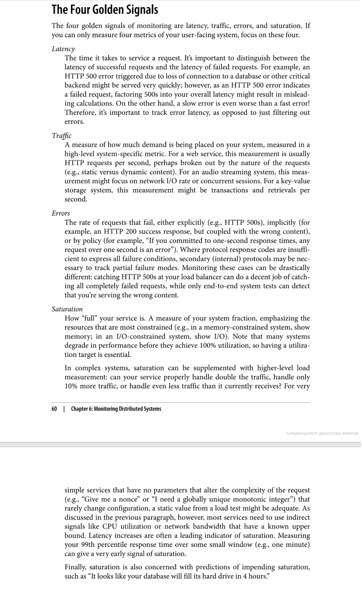

# The Principle and Measurement of Micreservice

## Principle

### Single Responsibility

> **TLDR: Gather together those things that change for the same reason, and separate those things that change for different reasons.**

Focus our service boundaries on business boundaries, making it obvious where code lives for a given piece of functionality. And by keeping this service foucsed on an explicit boundary, we avoid the temtation for it to grow too large.

### Autonomous

> **TLDR: Can you make a change to a service and deploy it without changing other services?**

Services need to be able to change independently of each other, and be deployed by themselves without requiring consumers to change. We need to think about what our services should expose, and what they should allow to be hidden.

All communication between the services are via network calls, to enforce separation between the services.

### Loose Coupling & High Cohesion - Bounded Context

A loosely coupled service knows as little as it needs to about the services with which it collaborates.

For high cohesion, related behavior should gathered together.

So we want to find **boundaries within our problem domain** that help ensure that related behavior is in one place, and that communicate with other boundaries as loosely as possible.

Any gived domain consists of multiple bounded contexts. Each bounded context has an explicit interface, where is decides what models to share with other contexts.

### Resilience & Scaling

The failure of one of the microservice shouldn't lead cascade failure in system. But once we built our microservice system, we need to remember, network can and will fail, as will machines. We need to know how to handle this, and what impact it should have on the end user.

As for scaling, microservices should can scale-in/scale-out easily without any code change.

### Evolution

> **TLDR: Change is constant.**

We can not build a perfect software in the beginning. Instead, focus on creating a structure which is reasonable and fits our needs, and continue to grow as we need more.

It's hard to prevision the change in the future, so rather than build a system and expect it can works all the time in the furture, we should plan to allow change, make our service more flexiable.

### No Silver Bullet

Don't expect perfect solution. The solution which fits the current situation (and enough flexiable) is good enough.

## How To

1. Define your strategic goals
2. Define architectural principles by goals
3. Design and delivery practices

Practices can be changed all the times, based on team structure, coding lanuages, etc. But once principles are defined, they remain fairly static.

### The Standard

System should be combined with multiple small components with their own lifecircles,  which may communicate with each other.

#### Monitoring

Should know how to monitoring the health of service. And the way to monitor should be light and unconscious, like a plugin.

#### Interfaces

The interfaces you exposed to other services. Which protocol you would use? How would you handle the resources? How to upgrade your service version if there are broken changes?

#### Security

We need to make sure our service can handle exceptions from dependencies.

We should have standard return code for each calls. Some normal situations like:

- Correctly received request and handled.
- A bad request but recognised
- Service shutdown

Usually, we need to defind our own business logic code the handle the received request, and can use some common interface status code like HTTP response code to deal system level status.

### Find Bounded Context

When you are thinking about the bounded context in your service, you shouldn't think in term of data sharing, but the capabilities those contexts can provide for other domain.

**Ask yourself:**

1. **What does this context do?**
2. **What data does it need to do that?**
3. **Make clear the internal interfaces and external interfaces**

Sometimes you don't need to defined the entire context at once. First think in terms of the larger, coarser-grained contexts, then split to find these small, nested ones.

### Hide Internal Detail

We never want our consumers to be bound to our internal implementation. Bound to implementation means, We have to force our consumer change with our service internal change.

### Two Common Structure - Orchestration vs Choreography

#### Orchestration

We rely on a central brain to guide and drive the process. When some event happened, central brain would handle that event, process it and post it to downstreams who need to rely on that. Brain need to make sure every downstream service received and handled that event succeed.

Obviously, the downside to this structure is that the brain service can become too much of a central governing authority. It can become the hub in the middle of a web, and a central point where logic starts to live.

#### Choreography

Instead of brain service in orchestration structure, we could just have the customer service emit an event in an  asynchronous manner. Other downstreams interested in these events can subscribe to them, and react accrodingly.

**Basicly, choreography structure is more flexiable and loosely coupled. But, you need to do some extra work to monitor and track the processes across system boundaries.**

### Don't Trust Network

**The network is not reliable.** You have to thinking and thinking and thinking about the stability of the communication between different microservices.

### Services as State Machines

### Version Control

#### Make your service flexiable

To defer version change as long as possible.

**Postel's Low/Robustness Principle - Be conservative in what you do, be liberal in what you accept from others.**

#### Using Semantic Versioning

> Learn Semantic Versioning: [Semantic Versioning 2.0.0](https://semver.org/)

Make version number follow the rules: **MAJOR.MINOR.PATCH**

- MAJOR: backward incompatible change
- MINOR: new functionality has benn added that should be backward compatible
- PATCH: bugfix to existing functionality

#### Coexist Different Endpoints

### Transaction

#### Eventual Consistency

In non-microservice system, we can use transaction to make sure data consistency. But when using microservice, business logic dispersed in different microservice. Sometimes when error happened, it's hard to recall, but we can mark that error and keep retry, this was called **eventual consistency**. Ranther than using transaction to keep consistency, it accept system well go into a consistency state at some point in the future.

#### Distributed Transactions

- two-phase commit
- three-phase commit

Actually there is no bullet for this problem. The answer is: it depends. Depend on the real situation, and on what you real conern about.

## Measurement

The **RED Method**: key metrics for microservices architecture

The RED Method defines the three key metrics you should measure for every microservice in your architecture. Those metrics are:

- **(Request) Rate** - the number of requests, per second, you services are serving.
- **(Request) Errors** - the number of failed requests per second.
- (Request) Duration - distributions of the amount of time each request takes.

### [Four Golden Signals by Google](https://books.google.de/books?id=_4rPCwAAQBAJ&pg=PA60&lpg=PA60&dq=four+golden+signals&source=bl&ots=pykFazLQUn&sig=q4VKDwsmyTTDZXatsxIWoVKEWUM&hl=de&sa=X&ved=0ahUKEwi0kuDttbDOAhUM7hoKHTkDAjYQ6AEISjAN#v=onepage&q&f=false)

Five measurement (extends from four golden signals):

- Load – measures how much demand/traffic is on the service. Normally measures in requests/sec.
- Latency – response time of the service requests that have no error. Normally measures in milliseconds.
- Errors – number of errors. Can be measured as errors per second or as a percentage of the overall number of requests vs number of requests with error.
- Saturation – measures how full the most constrained resources of a service are. Can be the utilization of a thread pool.
- Instances – the number of instances of a service. Can be number of containers that are delivering the same service or number of Tomcat application servers that have a service deployed.

**Typical problems that are detected are:**

- The error rate is higher than normal.
- The performance of the service is slow.
- There is a sudden drop or increase of load.
- The saturation of the service is close to reaching a limit.
- There are too few or too many instances available for the current load.

Different aspects of a system should be measured with different levels of granularity. For example:

- Observing CPU load over the time span of a minute won't reveal even quite long-lived spikes that drive high tail latencies.
- On the other hand, for a web service targeting on more than 9 hours aggregate downtime per year (99.9% annual uptime), probing for a 200 (success) status more than once or twice a minute is probably unnecessarily frequent.
- Similary, checking hard drive fullness for a service targeting 99.9% availability more than once every 1-2 minutes is probably unnecessary.

**Collecting per-second measurements of CPU load might yield interesting data, but such frequent measurements may be very expensive to collect, store, and analyze.**

### 12-Factors (partly)

#### Process

Execute the app as one or more stateless process. **Process are stateless and share-nothing**. Any data that needs to persist must be stored in a stateful backing service, typically a database.

#### Concurrency

The share-nothing, horizontally partitionable nature of 12-fatocr app process means that adding more concurrency is a simple and reliable operation.

#### Disposability

The 12-factor app's process are disposable, meaning they can be stoped or started at a moment's notice. This facilitates fast scaling, rapid deployment of code or config changes, and robustness of production deploys.

- Process should strive to minimize startup time.
- Process shut down gracefully when they receive a SIGTERM signal.
- Process should also be robust against sudden death.
- **Implicit in this model is that all jobs are reentrant, which typically is archived by wrapping the results in a transaction, or making the operation idempotent.**

#### Configuration

**Configuration SHOULD NOT store in the code.** A litmus test for whether an app has call config correctly factored out of the code is whether the codebase could be made open source at any moment, without compromising any credentials.

#### Dev/Prod Environment Parity

Keep development, staging, and production as similar as possible.

#### Logs

**Treat logs as event streams.**

Logs are the streams of aggregated, time-ordered events collected from the output streams of all running processes and backing services.

## References

### Measurement and monitor

- Monitoring a production-ready microservice
- Resiliency and high availability in microservices

### Books or Articles

- Building Microservices
- Production-Ready Microservices
- The Twelve-Factor App
- Guiding Principles of Lean Development
