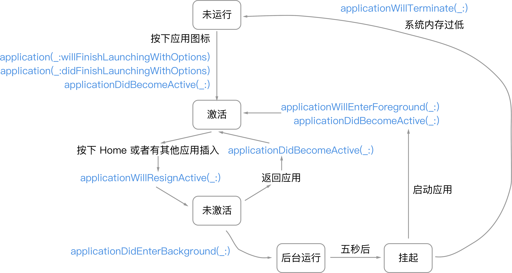

<!-- START doctoc generated TOC please keep comment here to allow auto update -->
<!-- DON'T EDIT THIS SECTION, INSTEAD RE-RUN doctoc TO UPDATE -->
**Table of Contents**  *generated with [DocToc](https://github.com/thlorenz/doctoc)*

- [iOS 开发入坑记录](#ios-%E5%BC%80%E5%8F%91%E5%85%A5%E5%9D%91%E8%AE%B0%E5%BD%95)
  - [文章](#%E6%96%87%E7%AB%A0)
  - [应用生命周期](#%E5%BA%94%E7%94%A8%E7%94%9F%E5%91%BD%E5%91%A8%E6%9C%9F)
  - [View Controller](#view-controller)
  - [布局](#%E5%B8%83%E5%B1%80)
  - [Multiple MVCs](#multiple-mvcs)
  - [UIKit](#uikit)
    - [UIView 的图层等级](#uiview-%E7%9A%84%E5%9B%BE%E5%B1%82%E7%AD%89%E7%BA%A7)
    - [UIView Bounds vs Frame vs Center - Coordinate systems](#uiview-bounds-vs-frame-vs-center---coordinate-systems)
    - [Gesture Recognizers](#gesture-recognizers)
    - [UI Animations](#ui-animations)
    - [Auto Layout](#auto-layout)
    - [版本检测](#%E7%89%88%E6%9C%AC%E6%A3%80%E6%B5%8B)
    - [UITextField](#uitextfield)
    - [日期](#%E6%97%A5%E6%9C%9F)
    - [本地化](#%E6%9C%AC%E5%9C%B0%E5%8C%96)
    - [HMAC](#hmac)
    - [定时器`Timer`](#%E5%AE%9A%E6%97%B6%E5%99%A8timer)
    - [扩展`Equatable`&`Comparable`](#%E6%89%A9%E5%B1%95equatablecomparable)
    - [status bar](#status-bar)
    - [使用`CustomStringConvertible`](#%E4%BD%BF%E7%94%A8customstringconvertible)
    - [Swift Playground](#swift-playground)
  - [HTTP 请求和线程](#http-%E8%AF%B7%E6%B1%82%E5%92%8C%E7%BA%BF%E7%A8%8B)
    - [JSON 解析](#json-%E8%A7%A3%E6%9E%90)
      - [`JSONSerialization`](#jsonserialization)
      - [`Codable`/`Encodable`/`Decodable`](#codableencodabledecodable)
    - [线程和阻塞](#%E7%BA%BF%E7%A8%8B%E5%92%8C%E9%98%BB%E5%A1%9E)
      - [利用`DispatchSemaphore`进行主线程阻塞](#%E5%88%A9%E7%94%A8dispatchsemaphore%E8%BF%9B%E8%A1%8C%E4%B8%BB%E7%BA%BF%E7%A8%8B%E9%98%BB%E5%A1%9E)
      - [在请求完成之后回到主线程进行绘制](#%E5%9C%A8%E8%AF%B7%E6%B1%82%E5%AE%8C%E6%88%90%E4%B9%8B%E5%90%8E%E5%9B%9E%E5%88%B0%E4%B8%BB%E7%BA%BF%E7%A8%8B%E8%BF%9B%E8%A1%8C%E7%BB%98%E5%88%B6)
  - [多线程 GCD - Grand Central Dispatch](#%E5%A4%9A%E7%BA%BF%E7%A8%8B-gcd---grand-central-dispatch)

<!-- END doctoc generated TOC please keep comment here to allow auto update -->

## iOS 开发入坑记录

### 文章

- [官方文档：View Controller Programming Guide for iOS](https://developer.apple.com/library/content/featuredarticles/ViewControllerPGforiPhoneOS/index.html#//apple_ref/doc/uid/TP40007457-CH2-SW1)
- [官方 Tutorial，开发一个小 Demo](https://developer.apple.com/library/content/referencelibrary/GettingStarted/DevelopiOSAppsSwift/index.html#//apple_ref/doc/uid/TP40015214-CH2-SW1)
- [iOS11 中出现的新 API](https://chariotsolutions.com/tags/ios11/)

### 应用生命周期



### View Controller

View Controller 的生命周期

- [Work with View Controllers](https://developer.apple.com/library/content/referencelibrary/GettingStarted/DevelopiOSAppsSwift/WorkWithViewControllers.html)

```Swift
override func viewDidLoad() {
  super.viewDidLoad()
  // do the primary setup
  // update your View using your Model

  // ATTENTION
  // 1. 不要在这里进行 view 相关的绘制，因此此时 App 的边界还没有被设置
  // 2. 可以在这里进行准备工作
  //    - 类中成员对象和变量的初始化
  //    - 获取数据
  // 3. 该方法只会在布局时调用一次
}

override func viewWillAppear(_ animated: Bool) {
  super.viewWillAppera(animated)
  // catch your View up to data

  // ATTENTION
  // 该生命周期可以被调用多次
}

override func viewDidAppear(_ animated: Bool) {
  super.viewDidAppear(animated)
  // maybe start a timer or an animation or start observing something(e.g. GPS position)
  // There is also a good place to start something expensive going, for example, network fetching

  // ATTENTION
  // 1. 在这里再绘制 UI 就太晚了！！！
  // 2. 可以进行一些 UI 展示操作，例如，动效
  // 3. 当该方法调用时，并不能保障 UI 一定是可见的：它可能会被遮挡或者隐藏
}

// 可能在用户点击了返回按钮，或者切换了不同的 tab 时触发
override func viewWillDisappear(_ animated: Bool) {
  super.viewWillDisappear(animated)
  // Usually you undo what you do in viewDidAppear
  // For example: stop a timer or stop observer

  // 1. 进行收尾工作
  // 2. 保存用户的修改
  // 3. 取消监听器、responser
}

override func viewDidDisappear(_ animated: Bool) {
  super.viewDidDisappear(animated)
  // clean up MVC
}

/*
Geometry
You get notified when your top-level view's bounds change,
or otherwise need a re-layout
可以在下面两个生命周期时进行 view 的重绘
*/
override func viewWillLayoutSubviews() {}
override func viewDidLayoutSubviews() {}

/*
Autorotation
当设备旋转时会被触发。此时边界 bounds 改变，因此 viewWillLayoutSubviews/viewDidLayoutSubviews 也会被触发
如果需要自己手动进行布局或者设置动画，则可以使用下面的生命周期
*/
override func viewWillTransition(
  to size: CGSize,
  with coordinator: UIViewControllerTransitionCoordinator
) {
  super.viewWillTransition(to: size, with: coordinator)
}

/*
Low memory
This usually means a builup for very large video, image, sounds
如果你的 App 对那些占用较大内存的对象保持了强指针引用，就有可能会触发该警告
*/
override func didReceiveMemoryWarning() {
  super.didReceiveMemoryWarning()
  // 此时应该对不用的对象取消引用，在使用的时候重新创建
  // 如果持续触发该警告，则 App 会被 iOS 强制杀死
}

/*
Wakeup from a storyboard
如果一个对象的 awakeFromNib 函数被调用，就表明这个对象已经成功的通过 nib 文件创建
只用通过 IB 或者是 Storyboard 的方式创建的对象才会调用该函数
*/
override func awakeFromNib() {
  super.awakeFromNib()
}
```

整体流程：


1. 应用实例化 Instantiated（Usually from storyboard）
2. `awakeFromNib`（只有通过 storyboard 实例化时才会被调用）
3. segue preparation happens
4. outlets get set
5. `viewDidLoad`
6. 当控制器的视图在屏幕上出现/消失时，
  - `viewWillAppear`/`viewDidAppear`
  - `viewWillDisappear`/`viewDidDisappear`
7. 在`viewDidLoad`之后，UI 绘制方法可以在任意时刻被调用
 - `viewWillLayoutSubviews`
 - `viewDidLayoutSubviews`
8. 当内存不足时，会收到`didReceiveMemoryWarning`警告

### 布局

- 内容变多优先级`content hugging priorities`

表示视图大小在某个维度上不会比内容多的可能性。取值范围`0~1000`，`1000`表示视图大小肯定不会比内容多。

因此，优先级低的视图会在某个维度上被拉伸

- 内容抗压优先级`content compression resistance priorities`

和内容变多优先级相反：优先级低的视图会在某个维度上被压缩

### Multiple MVCs

### [UIKit](https://developer.apple.com/documentation/uikit)

- [Apple Developer Documentation](https://developer.apple.com/documentation/)
- [UIColor](https://developer.apple.com/documentation/uikit/uicolor)

官方系列教程

- [UIView 概览](https://developer.apple.com/documentation/uikit/uiview)
- [View Programming Guide for iOS](https://developer.apple.com/library/content/documentation/WindowsViews/Conceptual/ViewPG_iPhoneOS/WindowsandViews/WindowsandViews.html#//apple_ref/doc/uid/TP40009503-CH2-SW1)

```Swift
// 创建 View 的时候，要把 View 放入到一个`frame`里，也就是需要指定其父 View
let rect = CGReat(x: 10, y: 10, width: 100, height: 100)
let myView = UIView(frame: rect)

// 而父 View 也可以通过 addSubView 等方式来添加子 View
view.addSubview(subView)
view.insertSubview(subView, at: index)
view.insertSubview(subView, aboveSubview: aboveSubview)
view.insertSubview(subView, belowSubview: belowSubview)
view.exchangeSubview(at: index1, withSubviewAt: index2)

// 当 View 的内容更新时，可以通过 setNeedsDisplay() 或者setNeedsDisplay(_:) 来请求 UI 更新
// 该方法不会立即更新 UI，而是在下一次绘制的生命周期时进行批量的更新、

// 除此以外，有关 UI 的更新必须在主线程进行
OperationQueue.main.addOperation {
  // 更新主线程 UI
}
```

#### UIView 的图层等级

- [UIView subviews' order?](https://stackoverflow.com/questions/18636227/uiview-subviews-order)
- [UIView Positioning for iPhone: Any concept of “Z-Index”?](https://stackoverflow.com/questions/6346144/uiview-positioning-for-iphone-any-concept-of-z-index)
- [When is layoutSubviews called?](https://stackoverflow.com/questions/728372/when-is-layoutsubviews-called)

总结而言：

- index 越小，越在底层。也就是相对于用户更加远的图层，会被 index 大的图层遮挡
- `view.addSubview(subView)` 把子视图添加到最顶部，即 index 最大
- `view.insertSubview(subView, at)` 把子视图添加到指定位置
- `view.insertSubview(subView, aboveSubview)` 将子视图插入到指定视图上面
- `view.insertSubview(subView, belowSubview)` 将子视图插入到指定视图下面
- `view.exchangeSubview(at:withSubviewAt:)` 把两个子视图的层级调换

#### UIView Bounds vs Frame vs Center - Coordinate systems

- [Swift: UIView Bounds vs Frame vs Center](https://gabrielghe.github.io/swift/2015/03/22/swift-uiview-bounds-vs-frame-vs-center)
- [Cocoa: What's the difference between the frame and the bounds?](https://stackoverflow.com/questions/1210047/cocoa-whats-the-difference-between-the-frame-and-the-bounds)

---

- `bounds`: UIView 自身的大小和位置
- `frame`: UIView 相对于其父 View 的大小和位置
- `center`: UIView 相对于其父 View 的中点。如果要获取 UIView 自身绝对中点（相对于屏幕），则`convertPoint(center, fromView: superview)`

当父 View 和子 View 都没有旋转时，子 View 的`frame`/`center`/`bounds`之间会有这样的关系：

- `frame.origin = center - (bounds.size / 2.0)`
- `center = frame.origin + (bounds.size / 2.0)`
- `frame.size = bounds.size`

#### Gesture Recognizers

- [Swift 3 Gesture Recognizers](https://swift3tutorials.com/swift-3-gesture-recognizers/)
- [Swift 4 - Adding UITapGestureRecognizer to a subview image](https://stackoverflow.com/questions/46583964/swift-4-adding-uitapgesturerecognizer-to-a-subview-image-the-methiod-is-not)
- [How to call gesture tap on UIView programmatically in swift](https://stackoverflow.com/questions/28675209/how-to-call-gesture-tap-on-uiview-programmatically-in-swift)
- [UIGestureRecognizer Tutorial - Getting Started](https://www.raywenderlich.com/162745/uigesturerecognizer-tutorial-getting-started)

#### UI Animations

- [iOS Animation Tutorial](https://www.raywenderlich.com/173544/ios-animation-tutorial-getting-started-3)
- [UIViewPropertyAnimator](https://developer.apple.com/documentation/uikit/uiviewpropertyanimator)
- [Quick Guide: Animations with UIViewPropertyAnimator](http://www.thinkandbuild.it/quick-guide-animations-with-uiviewpropertyanimator/)

`UIViewPropertyAnimator`和`UIView.animation`很相似，也可以将 View 的一些属性进行逐步的转换来达到动态的效果，也能够设定延迟动画。但通过`UIViewPropertyAnimator`，可以在动画的过程中进行动态的调整，并随时将动画在`stop`/`pause`/`start`状态间切换

```Swift
// Create a UIViewPropertyAnimator object. Here's a simple one with a UIKit animation curve:
let colorChange = UIViewPropertyAnimator(duration: 0.3, curve: .easeIn, animations: { [weak self] in
  self?.view.backgroundColor = UIColor(red: 255.0/255.0, green: 80.0/255.0, blue: 43.0/255.0, alpha: 1.0)
})

// There's also support for easy spring-based animations - all you need to set is a damping ratio (a value between 0 and 1). Alternatively, you can create your own curves by adopting the UITimingCurveProvider protocol.
let alphaChange = UIViewPropertyAnimator(duration: 0.3, dampingRatio: 0.6, animations: { [weak self] in
  self?.circleView.alpha = 0.0
})

// 开始动画
alphaChange.startAnimation()

// 暂停动画
alphaChange.pauseAnimation()

// 利用手势识别，在外部动态的改变一个动画的进度
@IBAction func handlePan(recognizer: UIPanGestureRecognizer) {
  let translation = recognizer.translationInView(self.view)
  let translatedCenterY = view.center.y + translation.y
  let progress = translatedCenterY / self.view.bounds.size.height
  colorChange.fractionComplete = progress
}

// 停止动画
colorChange?.stopAnimation(true)
```

#### Auto Layout

- [Auto Layout Guide](https://developer.apple.com/library/content/documentation/UserExperience/Conceptual/AutolayoutPG/index.html)
- 在 Storyboard 中以可视化的形式进行 Auto Layout: [Auto Layout Tutorial in iOS 11: Getting Started](https://www.raywenderlich.com/160527/auto-layout-tutorial-ios-11-getting-started)
- 利用`NSLayoutConstraint`在代码中创建 Auto Layout: [Programmatically Creating Constraints](https://developer.apple.com/library/content/documentation/UserExperience/Conceptual/AutolayoutPG/ProgrammaticallyCreatingConstraints.html)
- [Working with Auto Layout Visual Format Language and Programmatically Creating Constraints](https://www.appcoda.com/auto-layout-programmatically/)

#### 版本检测

- [Swift检测iOS系统版本方法汇总](https://www.jianshu.com/p/1bc825db26c9)
- [Hi! I'm #available!](https://www.bignerdranch.com/blog/hi-im-available/)
- [Availability Attributes in Swift](https://www.raywenderlich.com/139077/availability-attributes-swift)

#### UITextField

- [Getting to Know UITextField](https://grokswift.com/uitextfield/)
- [Five Simple Tips to Make User Friendly Forms on iOS](https://cocoacasts.com/five-simple-tips-to-make-user-friendly-forms-on-ios)
- [在Swift中整数以及浮点的格式化](http://www.cnblogs.com/sandal1980/p/3844307.html)
- [How do I check when a UITextField changes?](http://ioscake.com/how-do-i-check-when-a-uitextfield-changes.html)
- [Close iOS Keyboard by touching anywhere using Swift](https://stackoverflow.com/questions/24126678/close-ios-keyboard-by-touching-anywhere-using-swift)
- [Best way to dismiss Keyboard in a View Controller iOS (Swift)](https://medium.com/@KaushElsewhere/how-to-dismiss-keyboard-in-a-view-controller-of-ios-3b1bfe973ad1)


```Swift
// Swift4, iOS11: 点击任意地点关闭键盘
extension UIViewController {
  func hideKeyboardWhenTappedAround() {
    let tap: UITapGestureRecognizer = UITapGestureRecognizer(target: self, action: #selector(UIViewController.dismissKeyboard))
    tap.cancelsTouchesInView = false
    view.addGestureRecognizer(tap)
  }

  func dismissKeyboard() {
    view.endEditing(true)
  }
}
```

#### 日期

- [Convert Date To String & Vice-Versa Swift 4 - iOS](http://iosrevisited.blogspot.hk/2017/10/convert-date-string-swift4.html)

```Swift
let now = Date()

// 获取当前时间戳，单位秒，Double 类型
let timeStamp:TimeInterval = now.timeIntervalSince1970

// 格式化时间
let dateformatter = DateFormatter() // 创建日期格式器
dateformatter.dateFormat = "yyyy年MM月dd日 HH:mm:ss"
print("当前日期时间：\(dateformatter.string(from: now))")

// 时间戳转为时间
Date(timeIntervalSince1970: timeStamp)
```

#### 本地化

- [iOS国际化（本地化）详解](http://www.bijishequ.com/detail/378783)
- [ios10+swift3.0 app多语言——国际化和本土化](https://www.jianshu.com/p/b13945381795)
- [A different way to deal with Localized strings in Swift](https://medium.com/@dcordero/a-different-way-to-deal-with-localized-strings-in-swift-3ea0da4cd143)

```Swift
// 获取用户的当前地区
let currentLocale = Locale.current
// 读取本地化的变量
NSLocalizedString(variableString, comment: commentString)

// or
extension String {
  var localized: String {
    return NSLocalizedString(self, comment: "")
  }
}
"localeVariable".localized
```

#### HMAC

USE `CommonCrypto`

- [Implementing HMAC and SHA1 encryption in swift](https://stackoverflow.com/questions/26970807/implementing-hmac-and-sha1-encryption-in-swift)

```Swift
extension String {
  func hmac(key: String) -> String {
    // HMAC SHA1
    var digest = [UInt8](repeating: 0, count: Int(CC_SHA1_DIGEST_LENGTH))
    CCHmac(CCHmacAlgorithm(kCCHmacAlgSHA1), key, key.count, self, self.count, &digest)
    let data = Data(bytes: digest)
    // base64
    return data.base64EncodedString()
  }
}

print("test".hmac(key: "233"))
```

#### 定时器`Timer`

- [Build a count down timer with Swift 3.0](https://medium.com/ios-os-x-development/build-an-stopwatch-with-swift-3-0-c7040818a10f)

#### 扩展`Equatable`&`Comparable`

通过扩展`Equatable`，我们可以自己实现`==`比较符操作

```Swift
struct Item {
  var text: String
  var id: String = {
    return UUID().uuidString.components(separatedBy: "-").first!
  }()

  init(text: String) {
    self.text = text
  }
}

extension Item: Equatable {
  static func == (lhs: Photo, rhs: Photo) -> Bool {
    return lhs.id == rhs.id
  }
}

// 这样就可以直接通过 item1 == item2 来比较是否相等
```

而扩展`Comparable`，则需要实现`<`和`==`比较符

```Swift
struct Bill {
  var amount: Int
}

extension Bill: Comparable {
  static func <(lhs: Bill, rhs: Bill) -> Bool {
    return lhs.amount < rhs.amount
  }

  static func ==(lhs: Bill, rhs: Bill) -> Bool {
    return lhs.amount == rhs.amount
  }
}
```

更多关于复写操作符的介绍，可戳：

- [Overloading Custom Operators in Swift](https://www.raywenderlich.com/157556/overloading-custom-operators-swift)

#### status bar

改变 status bar 的背景色/字体色

- [How to change the status bar background color and text color on iOS 7?](https://stackoverflow.com/questions/19063365/how-to-change-the-status-bar-background-color-and-text-color-on-ios-7)
- [Change the Color of the Status Bar Tutorial](https://www.ioscreator.com/tutorials/change-color-status-bar-tutorial)

#### 使用`CustomStringConvertible`

让类/结构体扩展`CustomStringConvertible`协议后，会要求实现`description`属性。改属性可以在打印该类/结构体的实例时，返回更友好的输出，便于调试

```Swift
struct Bill {
  var amount: Int
}
let bill = Bill(amount: 100)
print(bill) // Bill(amount: 100)

extension Bill: CustomStringConvertible {
  var description: String {
    return "Bill amount is: \(self.amount)"
  }
}

print(bill) // Bill amount is: 100
```

#### Swift Playground

在`Playground`中执行代码时，会按照从上到下的顺序直接执行，并不等待异步、其他线程，在主线程执行完毕后退出。
如果需要阻止其自动退出，则需要标记手动退出：

```Swift
import PlaygroundSupport

// 标记需要手动退出
PlaygroundPage.current.needsIndefiniteExecution = true

// 创建异步代码
let workItem = DispatchWorkItem {
    print("233333")
    // 执行完之后需要手动退出
    PlaygroundPage.current.finishExecution()
}
// 延迟一秒后执行
DispatchQueue.main.asyncAfter(deadline: .now() + 1, execute: workItem)
```

### HTTP 请求和线程

在 Swift4 中使用`URLSession`进行网络请求。它是一个异步操作，不会阻塞主线程。

```Swift
// 可以通过两种方式构建 session 实例
// 自定义配置
let config = URLSessionConfiguration.default
let session = URLSession(configuration: config)

// 或者直接使用不可配置的单例
let session: URLSession = URLSession.shared
```

两者区别可戳：

- [Shared session vs. session with default configuration](https://stackoverflow.com/questions/25299166/shared-session-vs-session-with-default-configuration)
- [Developer document: URLSession](https://developer.apple.com/documentation/foundation/urlsession)

#### JSON 解析

##### `JSONSerialization`

```Swift
// JSONSerialization
let jsonObject = try? JSONSerialization.jsonObject(with: jsonData, options: [])

// 对于结构复杂的 JSON 对象，这种方法层层解析起来比较麻烦：
var weatherJsonString = """
{
"results": [
{
"location": {
"id": "WX4FBXXFKE4F",
"name": "北京",
"country": "CN",
"path": "北京,北京,中国",
"timezone": "Asia/Shanghai",
"timezone_offset": "+08:00"
},
"now": {
"text": "晴",
"code": "0",
"temperature": "-3"
},
"last_update": "2018-02-25T09:20:00+08:00"
}
]
}
"""

func parseWeather(dataString: String) {
  let jsonData = weatherJsonString.data(using: .utf8)!
  let jsonObject = try? JSONSerialization.jsonObject(with: jsonData, options: []) as! [String:AnyObject]
  print(jsonObject!)
  guard
    let results = jsonObject!["results"] as? [[String:AnyObject]],
    let result = results.first,
    let location = result["location"] as? [String:AnyObject],
    let now = result["now"] as? [String:AnyObject]
  else {
    print("Error: \(WeatherParseError.ParseError)")
    return
  }
  print(location)
  print(now)
}

parseWeather(dataString: weatherJsonString)
```

##### `Codable`/`Encodable`/`Decodable`

在 Swift4 中，新提供了三种协议：

1. `Encodable` 编码 JSON，我们需要实现`encode(to:)`方法
2. `Decodable` 解码 JSON，我们需要实现`init(from:)`方法
3. `Codable` 编码 & 解码，只需定义好数据结构即可

```Swift
// Codable
// 根据 JSON 格式定义好键名和值的类型
struct Photo: Codable {
  var title: String
  var url: URL
  var isSample: Bool
  // The Dictionary is of type [String:String] and String already conforms to Codable.
  var metaData: [String:String]

  //PhotoType and Size are also Codable types
  var type: PhotoType
  var size: Size
}

struct Size: Codable {
  var height: Double
  var width: Double
}

enum PhotoType: String, Codable {
  case flower
  case animal
  case fruit
  case vegetable
}
```

```Swift
// 直接对对象编码
let photoObject = Photo(
  title: "Hibiscus",
  url: URL(string: "https://www.flowers.com/hibiscus")!,
  isSample: false,
  metaData: ["color" : "red"],
  type: .flower,
  size: Size(height: 200, width: 200)
)
let encodedData = try? JSONEncoder().encode(photoObject)

// 相同结构下进行解码
let jsonString = """
{
  "type":"fruit",
  "size": {
    "width":150,
    "height":150
  },
  "title":"Apple",
  "url":"https:\\/\\/www.fruits.com\\/apple",
  "isSample":true,
  "metaData": {
    "color":"green"
  },
  "origin": "China"
}
"""
if let jsonData = jsonString.data(using: .utf8) {
  let photoObject = try? JSONDecoder().decode(Photo.self, from: jsonData)
  print(photoObject?.title) // "Apple"
  print(photoObject?.origin) // Error, 没有定义的键不存在
}
```

以上是严格按照 JSON 的格式进行解析的例子，如果需要自定义键值，或者去除一些不需要的值，则需要利用创建一个`CodingKeys`枚举并遵循`CodingKey`协议进一步改造：

```Swift
// CodingKeys 类似一个检查器，在 encoded 或者 decoded 时对其中的键值对进行检查
// 修改上一步的 Photo 结构体，增加一个 JSON 中不存在的键名，并且自定义两个键名
struct Photo: Codable {
  // ...
  // 在 CodingKeys 中没有定义的 format 键名会在编码/解码的时候被忽略
  var format: String = "png"

  // 通过 CodingKeys 枚举来改变键名
  enum CodingKeys: String, CodingKey {
    // 假设提供的 jsonString 中不存在名为 name 的键，则可以利用它解码后转换为 title；
    // 同理，编码后，原先 Photo 对象中的 title 属性会被编码为 name
    case title = "name"
    case url = "link"
    case isSample
    case metaData
    case type
    case size
  }
}
let jsonString = """
{
  "type":"fruit",
  "size": {
    "width":150,
    "height":150
  },
  "name":"Apple",
  "link":"https:\\/\\/www.fruits.com\\/apple",
  "isSample":true,
  "metaData": {
    "color":"green"
  },
  "format": "jpg"
}
"""

if let jsonData = jsonString.data(using: .utf8) {
  let photoObject = try? JSONDecoder().decode(Photo.self, from: jsonData)
  print(photoObject?.title) // "Apple"
  print(photoObject?.format) // "png"，因为 format 键没有在 CodingKeys 中定义
}
```

如果需要再进一步自定义，改变 JSON 的结构，则需要我们自己通过`Encodable`/`Decodable`协议来实现解析，而不再使用`Codable`

```Swift
// json 结构为 { size: { height, width } }，想解析为 { height, width }
struct Photo: Decodable {
  var height: Double
  var width: Double

  enum CodingKeys: String, CodingKey {
    case size
  }

  init(from decoder: Decoder) throws {
    let values = try decoder.container(keyedBy: CodingKeys.self)
    let size = try values.decode(Size.self, forKey: .size)
    height = size.height
    width = size.width
  }
}
```

进阶阅读：

- [Parsing JSON in Swift 4](https://grokswift.com/json-swift-4/)
- [Everything about Codable in Swift 4](https://hackernoon.com/everything-about-codable-in-swift-4-97d0e18a2999)
- [Ultimate Guide to JSON Parsing with Swift 4](https://benscheirman.com/2017/06/swift-json/)

#### 线程和阻塞

由于`URLSession`请求是一个在子线程进行的异步操作，所以在请求完成之后如果需要绘制 UI，则需要回到主线程。同时，在一些应用中，例如脚本，为了避免程序执行后自动退出，需要锁住主线程进行阻塞。

- [stackoverflow - Send make synchronous http request](https://stackoverflow.com/questions/40491502/swift-3-send-make-synchronous-http-request)

##### 利用`DispatchSemaphore`进行主线程阻塞

- [A Quick Look at Semaphores in Swift](https://medium.com/swiftly-swift/a-quick-look-at-semaphores-6b7b85233ddb)

> 注：这种方法在有 UI 交互的场景里不推荐！它会造成线程的阻塞

`DispatchSemaphore`的工作过程：

1. 创建一个信号量`semaphore`
  - 通过`value`参数标记有多少线程可以使用其资源（作为信号量的计数器）
  - 创建一个先入先出队列来储存请求资源的线程
2. 当调用`semaphore.wait()`方法时，信号量检查自身的计数器是否大于零
  - 计数器大于零，则计数器减一，并把资源给予请求的子线程
  - 计数器小于零，则将请求的线程放入到队列中去
3. 调用`semaphore.signal()`进行资源的释放，同时信号量检查其队列中是否还存有等待请求的线程
  - 有线程，则将其推出队列，给予资源
  - 没有线程，则自身计数器加一
4. 需要注意的是，当一个线程给信号量发送请求获取资源时（`.wait()`），该线程会一直冻结，直到信号量给予其资源。因此，在主线程调用时会造成阻塞

```Swift
// Demo: 通过请求获取一个 JSON 数据并解析
// 在异步运行过程中会进入子线程，为了防止主线程退出，可以设置信号灯 semaphore 使主线程阻塞直到请求完成
func httpRequest() -> Void {
  // 创建一个信号量，初始值为0
  // value 参数代表允许同时访问该资源的线程数量
  let semaphore = DispatchSemaphore(value: 0)

  let url: URL = URL(string: "exampleurl")
  let session: URLSession = URLSession.shared
  let request = URLRequest(url: url)
  let task = session.dataTask(with: request) {
    (data, response, error) -> Void in
    if let jsonData = data {
      // 解析 JSON
      let jsonObject = try? JSONSerialization.jsonObject(with: jsonData, options: [])
      print(jsonObject)
    }
    // 释放信号
    semaphore.signal()
  }
  // 执行异步请求
  task.resume()

  // 阻塞主线程，直到信号被释放
  semaphore.wait()
}
```

##### 在请求完成之后回到主线程进行绘制

```Swift
let task = session.dataTask(with: request) {
  (data, response, error) -> Void in
  if let jsonData = data {
    // 解析 JSON
    let jsonObject = try? JSONSerialization.jsonObject(with: jsonData, options: [])
    print(jsonObject)
    OperationQueue.main.addOperation {
      // 更新主线程 UI
    }
  }
}
// 执行异步请求
task.resume()
```

### 多线程 GCD - Grand Central Dispatch

- [Swift - 多线程实现方式](http://www.hangge.com/blog/cache/detail_743.html)
- [GCD精讲（Swift 3&4）](http://blog.csdn.net/Hello_Hwc/article/details/54293280)
- [All about Concurrency in Swift - Part 1: The Present](https://www.uraimo.com/2017/05/07/all-about-concurrency-in-swift-1-the-present/)
- [Grand Central Dispatch (GCD) and Dispatch Queues in Swift 3](https://www.appcoda.com/grand-central-dispatch/)

利用`DispatchWorkItem`创建一个异步执行的代码，并且可以取消

```Swift
let workItem = DispatchWorkItem {
  // Your async code goes in here
}

// 延迟一秒后执行
DispatchQueue.main.asyncAfter(deadline: .now() + 1, execute: workItem)

// 取消异步代码，不再指向
workItem.cancel()

// 在当前线程立即执行
workItem.perform()
// 在全局线程执行
DispatchQueue.global().async(execute: workItem)
```