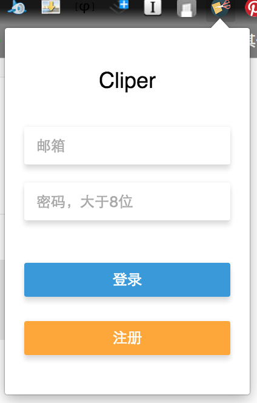
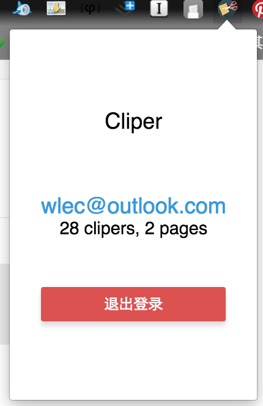

<!-- START doctoc generated TOC please keep comment here to allow auto update -->
<!-- DON'T EDIT THIS SECTION, INSTEAD RE-RUN doctoc TO UPDATE -->
**Table of Contents**  *generated with [DocToc](https://github.com/thlorenz/doctoc)*

- [Chrome扩展程序开发](#chrome%E6%89%A9%E5%B1%95%E7%A8%8B%E5%BA%8F%E5%BC%80%E5%8F%91)
  - [概述](#%E6%A6%82%E8%BF%B0)
    - [chrome扩展程序](#chrome%E6%89%A9%E5%B1%95%E7%A8%8B%E5%BA%8F)
    - [开发缘由](#%E5%BC%80%E5%8F%91%E7%BC%98%E7%94%B1)
  - [`manifest.json`](#manifestjson)
  - [不同运行环境JS的绳命周期](#%E4%B8%8D%E5%90%8C%E8%BF%90%E8%A1%8C%E7%8E%AF%E5%A2%83js%E7%9A%84%E7%BB%B3%E5%91%BD%E5%91%A8%E6%9C%9F)
    - [`content_scripts`](#content_scripts)
    - [`background`](#background)
    - [`browser_action`](#browser_action)
  - [不同运行环境JS之间的交互](#%E4%B8%8D%E5%90%8C%E8%BF%90%E8%A1%8C%E7%8E%AF%E5%A2%83js%E4%B9%8B%E9%97%B4%E7%9A%84%E4%BA%A4%E4%BA%92)
    - [chrome.runtime](#chromeruntime)
      - [普通的消息传递](#%E6%99%AE%E9%80%9A%E7%9A%84%E6%B6%88%E6%81%AF%E4%BC%A0%E9%80%92)
      - [长链接](#%E9%95%BF%E9%93%BE%E6%8E%A5)
    - [chrome.tabs](#chrometabs)
    - [chrome.storage](#chromestorage)
  - [学习资源](#%E5%AD%A6%E4%B9%A0%E8%B5%84%E6%BA%90)

<!-- END doctoc generated TOC please keep comment here to allow auto update -->

## Chrome扩展程序开发

> 十一在家无聊时开发了这个项目。其出发点是想通过chrome插件，来保存网页上选中的文本。后来就顺手把前后端都做了(Koa2 + React)：
>
> [chrome插件源码](https://github.com/ecmadao/cliper-chrome)
>
> [插件对应的前后端源码](https://github.com/ecmadao/cliper-backend)

### 概述

#### chrome扩展程序

chrome扩展程序大家应该都很熟悉了，它可以通过脚本帮我们完成一些快速的操作。通过插件可以捕捉到网页内容、标签页、本地存储，或者用户的操作行为；它也可以在一定程度上改变浏览器的UI，例如页面上右键的菜单、浏览器右上角点击插件logo后的弹窗，或者浏览器新标签页

#### 开发缘由

按照惯例，开发前多问问自己 why? how?

why：

- 我在平常看博文时，对于一些段落想进行摘抄或者备注，又懒得复制粘贴

how：

- 一个chrome扩展程序，可以通过鼠标右键的菜单，或者键盘快捷键快速保存当前页面上选择的文本
- 如果没有选择文本，则保存网页链接
- 要有对应的后台服务，保存 user、cliper、page (后话，本文不涉及)
- 还要有对应的前端，以便浏览我的保存记录 (后话，本文不涉及)

先上个成果图：






> clip 有剪辑之意，因此项目命名为 cliper

### [`manifest.json`](https://crxdoc-zh.appspot.com/extensions/manifest)

在项目根目录下创建`manifest.json`文件，其中会涵盖扩展程序的基本信息，并指明需要的权限和资源文件

```javascript
{
  // 以下为必写
  "manifest_version": 2, // 必须为2，1号版本已弃用
  "name": "cliper", // 扩展程序名称
  "version": "0.01", // 版本号
  
  // 以下为选填
  
  // 推荐
  "description": "描述",
  "icons": {
    "16": "icons/icon_16.png",
    "48": "icons/icon_48.png",
    "64": "icons/icon_64.png",
    "128": "icons/icon_128.png"
  },
  "author": "ecmadao",
  
  // 根据自己使用的权限填写
  "permissions": [
    // 例如
    "tab",
    "storage",
    // 如果会在js中请求外域API或者资源，则要把外域链接加入
    "http://localhost:5000/*"
  ],
  
  // options_page，指右键点击右上角里的插件logo时，弹出列表中的“选项”是否可点，以及在可以点击时，左键点击后打开的页面
  "options_page": "view/options.html",
  
  // browser_action，左键点击右上角插件logo时，弹出的popup框。不填此项则点击logo不会有用
  "browser_action": {
    "default_icon": {
      "38": "icons/icon_38.png"
    },
    "default_popup": "view/popup.html", // popup页面，其实就是普通的html
    "default_title" : "保存到cliper"
  },
  
  // background，后台执行的文件，一般只需要指定js即可。会在浏览器打开后全局范围内后台运行
  "background": {
    "scripts": ["js/vendor/jquery-3.1.1.min.js", "js/background.js"],
    // persistent代表“是否持久”。如果是一个单纯的全局后台js，需要一直运行，则不需配置persistent（或者为true）。当配置为false时转变为事件js，依旧存在于后台，在需要时加载，空闲时卸载
    "persistent": false
  },
  
  // content_scripts，在各个浏览器页面里运行的文件，可以获取到当前页面的上下文DOM
  "content_scripts": [
    {
      // matches 匹配 content_scripts 可以在哪些页面运行
      "matches" : ["http://*/*", "https://*/*"],
      "js": ["js/vendor/jquery-3.1.1.min.js", "js/vendor/keyboard.min.js", "js/selection.js", "js/notification.js"],
      "css": ["css/notification.css"]
    }
  ]
}
```

综上，我们一共有三种资源文件，针对着三个运行环境：

- `browser_action`
    - 控制logo点击后出现的弹窗，涵盖相关的html/js/css
    - 在弹窗中，会进行登录/注册的操作，并将用户信息保存在本地储存中。已登录用户则展现基本信息
- `background`
    - 在后台持续运行，或者被事件唤醒后运行
    - 右键菜单的点击和异步保存事件将在这里触发
- `content_scripts`
    - 当前浏览的页面里运行的文件，可以操作DOM
    - 因此，我会在这个文件里监听用户的选择事件

注：

- `content_scripts`中如果没有`matches`，则扩展程序无法正常加载，也不能通过“加载未封装的扩展程序”来添加。如果你的`content_scripts`中有js可以针对所有页面运行，则填写`"matches" : ["http://*/*", "https://*/*"]`即可
- 推荐将`background`中的`persistent`设置为`false`，根据事件来运行后台js

### 不同运行环境JS的绳命周期

如上所述，三种JS有着三种运行环境，它们的生命周期、可操作DOM/接口也不同

#### [`content_scripts`](https://crxdoc-zh.appspot.com/extensions/content_scripts)

> `content_scripts`会在每个标签页初始化加载的时候进行调用，关闭页面时卸载

内容脚本，在每个标签页下运行。虽然它可以访问到页面DOM，但无法访问到这个里面里，其他JS文件创建的全局变量或者函数。也就是说，各个`content_scripts`(以及外部JS文件)之间是相互独立的，只有：

```javascript
"content_scripts": [
  {
    "js": [...]
  }
]
```

`js`所定义的一个Array里的各个JS可以相互影响。

#### [`background`](https://crxdoc-zh.appspot.com/extensions/event_pages)

> 官方建议将后台js配置为`"persistent": false`，以便在需要时加载，再次进入空闲状态后卸载

什么时候会让`background`的资源文件加载呢？

- 应用程序第一次安装或者更新
- 监听某个事件触发(例如`chrome.runtime.onInstalled.addListener`)
- 监听其他环境的JS文件发送消息(例如`chrome.runtime.onMessage.addListener`)
- 扩展程序的其他资源文件调用了`runtime.getBackgroundPage`

#### [`browser_action`](https://crxdoc-zh.appspot.com/extensions/browserAction)

> `browser_action`里的资源会在弹窗打开时初始化，关闭时卸载

`browser_action`里定义的JS/CSS运行环境仅限于popup，并且会在每次点开弹窗的时候初始化。但是它可以调用一些`chrome api`，以此来和其他js进行交互

除此以外：

- `browser_action`的HTML文件里使用的JS，不能直接以`<script></script>`的形式行内写入HTML里，需要独立成JS文件再引入
- 如果有其他第三方依赖，比如`jQuery`等文件，也无法通过CDN引入，而需要保持资源文件到项目目录后再引入

### 不同运行环境JS之间的交互

虽然运行环境和绳命周期都不相同，但幸运的是，chrome为我们提供了一些三种JS都通用的API，可以起到JS之间相互通讯的效果。

#### [chrome.runtime](https://crxdoc-zh.appspot.com/extensions/runtime)

> [消息传递](https://crxdoc-zh.appspot.com/apps/messaging)

##### 普通的消息传递

通过`runtime`的`onMessage`、`sendMessage`等方法，可以在各个JS之间传递并监听消息。举个栗子：

在`popup.js`中，我们让它初始化之后发送一个消息：

```javascript
chrome.runtime.sendMessage({
  method: 'showAlert'
}, function(response) {});
```

然后在`background.js`中，监听消息的接收，并进行处理：

```javascript
chrome.runtime.onMessage.addListener(function(message, sender, sendResponse) {
  if (message.method === 'showAlert') {
    alert('showAlert');
  }
});
```

以上代码，会在每次打开插件弹窗的时候弹出一个Alert。

`chrome.runtime`的常用方法：

```javascript
// 获取当前扩展程序中正在运行的后台网页的 JavaScript window 对象
chrome.runtime.getBackgroundPage(function (backgroundPage) {
  // backgroundPage 即 window 对象
});
// 发送消息
chrome.runtime.sendMessage(message, function(response) {
  // response 代表消息回复，可以接受到通过 sendResponse 方法发送的消息回复
});
// 监听消息
chrome.runtime.onMessage.addListener(function(message, sender, sendResponse) {
  // message 就是你发送的 message
  // sender 代表发送者，可以通过 sender.tab 判断消息是否是从内容脚本发出
  // sendResponse 可以直接发送回复，如：
  sendResponse({
    method: 'response',
    message: 'send a response'
  });
});
```

需要注意的是，即便你在多个JS中注册了消息监听`onMessage.addListener`，也只有一个监听者能收到通过`runtime.sendMessage`发送出去的消息。如果需要不同的监听者分别监听消息，则需要使用`chrome.tab` API来指定消息接收对象

举个栗子：

上文说过，需要在`content_scripts`中监听选择事件，获取选择的文本，而对于右键菜单的点击则是在`background`中监听的。那么需要把选择的文本作为消息，发送给`background`，在`background`完成异步保存。

```javascript
// content_scripts 中获取选择，并发送消息
// js/selection.js

// 获取选择的文本
function getSelectedText() {
  if (window.getSelection) {
    return window.getSelection().toString();
  } else if (document.getSelection) {
    return document.getSelection();
  } else if (document.selection) {
    return document.selection.createRange().text;
  }
}
// 组建信息
function getSelectionMessage() {
  var text = getSelectedText();
  var title = document.title;
  var url = window.location.href;
  var data = {
    text: text,
    title: title,
    url: url
  };
  var message = {
    method: 'get_selection',
    data: data
  }
  return message;
}
// 发送消息
function sendSelectionMessage(message) {
  chrome.runtime.sendMessage(message, function(response) {});
}
// 监听鼠标松开的事件，只有在右键点击时，才会去获取文本
window.onmouseup = function(e) {
  if (!e.button === 2) {
    return;
  }
  var message = getSelectionMessage();
  sendSelectionMessage(message);
};
```

```javascript
// background 中接收消息，监听右键菜单的点击，并异步保存数据
// js/background.js

// 创建一个全局对象，来保存接收到的消息值
var selectionObj = null;

// 首先要创建菜单
chrome.runtime.onInstalled.addListener(function() {
  chrome.contextMenus.create({
    type: 'normal',
    title: 'save selection',
    id: 'save_selection',
    // 有选择才会出现
    contexts: ['selection']
  });
});
// 监听菜单的点击
chrome.contextMenus.onClicked.addListener(function(menuItem) {
  if (menuItem.menuItemId === "save_selection") {
    addCliper();
  }
});

// 消息监听，接收从 content_scripts 传递来的消息，并保存在一个全局对象中
chrome.runtime.onMessage.addListener(function(message, sender, sendResponse) {
  if (message.method === 'get_selection') {
    selectionObj = message.data;
  }
});

// 异步保存
function addCliper() {
  $.ajax({
    // ...
  });
}
```

##### 长链接

通过`chrome.runtime.connect`（或者`chrome.tabs.connect`）可以建立起不同类型JS之间的长链接。

信息的发送者需要制定独特的信息类型，发送并监听信息：

```javascript
var port = chrome.runtime.connect({type: "connection"});
port.postMessage({
  method: "add",
  datas: [1, 2, 3]
});
port.onMessage.addListener(function(msg) {
  if (msg.method === "answer") {
  	console.log(msg.data);
  }
});
```

而接受者则要注册监听，并判断消息的类型：

```javascript
chrome.runtime.onConnect.addListener(function(port) {
  console.assert(port.type == "connection");
  port.onMessage.addListener(function(msg) {
    if (msg.method == "add") {
      var result = msg.datas.reduce(function(previousValue, currentValue, index, array){
      return previousValue + currentValue;
  });
      port.postMessage({
        method: "answer",
        data: result
      });
    }
  });
});
```

#### [chrome.tabs](https://crxdoc-zh.appspot.com/extensions/tabs)

要使用这个API则需要先在`manifest.json`中注册：

```javascript
"permissions": [
  "tabs",
  // ...
]
```

```javascript
// 获取到当前的Tab
chrome.tabs.getCurrent(function(tab) {
  // 通过 tab.id 可以拿到标签页的ID
});

// 通过 queryInfo，以Array的形式筛选出符合条件的tabs
chrome.tabs.query(queryInfo, function(tabs) {})

// 精准的给某个页面的`content_scripts`发送消息
chrome.tabs.sendMessage(tabId, message, function(response) {});
```

举个栗子：

在`background.js`中，我们获取到当前Tab，并发送消息：

```javascript
chrome.tabs.getCurrent(function(tab) {
  chrome.tabs.sendMessage(tab.id, {
    method: 'tab',
    message: 'get active tab'
  }, function(response) {});
});
// 或者
chrome.tabs.query({active: true, currentWindow: true}, function(tabs) {
  chrome.tabs.sendMessage(tabs[0].id, {
    method: 'tab',
    message: 'get active tab'
  }, function(response) {
  });
});
```

然后在`content_scripts`中，进行消息监听：

```javascript
chrome.runtime.onMessage.addListener(function(message, sender, sendResponse) {
  if (message.method === 'tab') {
    console.log(message.message);
  }
});
```

#### [chrome.storage](https://crxdoc-zh.appspot.com/apps/storage)

`chrome.storage`是一个基于`localStorage`的本地储存，但chrome对其进行了IO的优化，可以储存对象形式的数据，也不会因为浏览器完全关闭而清空。

同样，使用这个API需要先在`manifest.json`中注册：

```javascript
"permissions": [
  "storage",
  // ...
]
```

`chrome.storage`有两种形式，`chrome.storage.sync`和`chrome.storage.local`：

`chrome.storage.local`是基于本地的储存，而`chrome.storage.sync`会先判断当前用户是否登录了google账户，如果登录，则会将储存的数据通过google服务自动同步，否则，会使用`chrome.storage.local`仅进行本地储存

> 注：因为储存区没有加密，所以不应该储存用户的敏感信息

API:

```javascript
// 数据储存
StorageArea.set(object items, function callback)

// 数据获取
StorageArea.get(string or array of string or object keys, function callback)

// 数据移除
StorageArea.remove(string or array of string keys, function callback)

// 清空全部储存
StorageArea.clear(function callback)

// 监听储存的变化
chrome.storage.onChanged.addListener(function(changes, namespace) {});
```

举栗子：

我们在`browser_action`完成了用户的登录/注册操作，将部分用户信息储存在`storage`中。每次初始化时，都会检查是否有储存，没有的话则需要用户登录，成功后再添加：

```javascript
// browser_action
// js.popup.js

chrome.storage.sync.get('user', function(result) {
  // 通过 result.user 获取到储存的 user 对象
  result && setPopDOM(result.user);
});

function setPopDOM(user) {
  if (user && user.userId) {
    // show user UI
  } else {
    // show login UI
  }
};

document.getElementById('login').onclick = function() {
  // login user..
  // 通过 ajax 请求异步登录，获取到成功的回调后，将返回的 user 对象储存在 storage 中
  chrome.storage.sync.set({user: user}, function(result) {});
}
```

而在其他环境的JS里，我们可以监听`storage`的变化：

```javascript
// background
// js/background.js

// 一个全局的 user 对象，用来保存用户信息，以便在异步时发生 userId
var user = null;

chrome.storage.onChanged.addListener(function(changes, namespace) {
  for (key in changes) {
    if (key === 'user') {
      console.log('user storage changed!');
      user = changes[key];
    }
  }
});
```

> 大体上，我们目前为止理清了三种环境下JS的不同，以及他们交流和储存的方式。除此以外，还有popup弹窗、右键菜单的创建和使用。其实使用这些知识就足够做出一个简单的chrome扩展了。
>
> 在这之后，如果需要将自己的扩展程序发布到chrome商店，则需要在[开发者信息中心](https://chrome.google.com/webstore/developer/dashboard/)进行登记，并缴费5刀。此时可以参照[如何成为一名Chrome应用开发者](https://segmentfault.com/a/1190000006035525)一文来通过验证。

### 学习资源

- [建立 Chrome 扩展程序](https://crxdoc-zh.appspot.com/extensions/getstarted)
- [Chrome插件（Extensions）开发攻略](http://www.cnblogs.com/guogangj/p/3235703.html)
- [如何成为一名Chrome应用开发者](https://segmentfault.com/a/1190000006035525)
- [chrome扩展的开发](https://segmentfault.com/a/1190000005071240)

注：本文源码位于[github仓库：cliper-chrome](https://github.com/ecmadao/cliper-chrome)