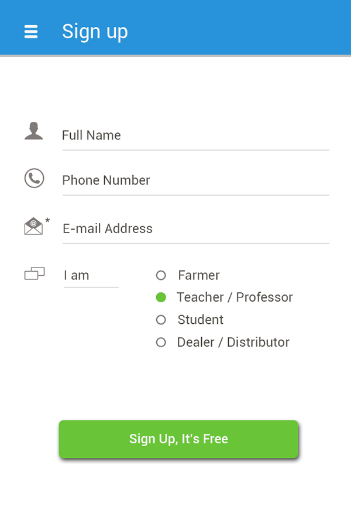
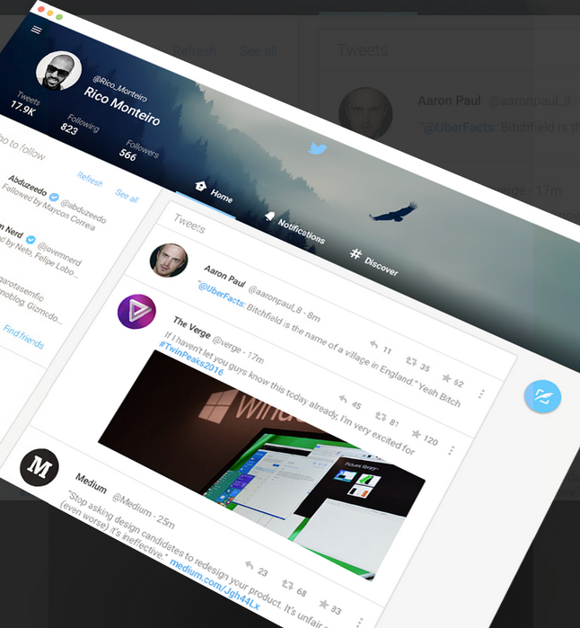
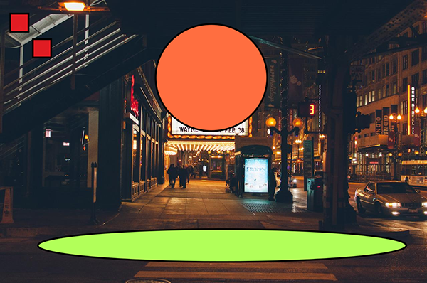
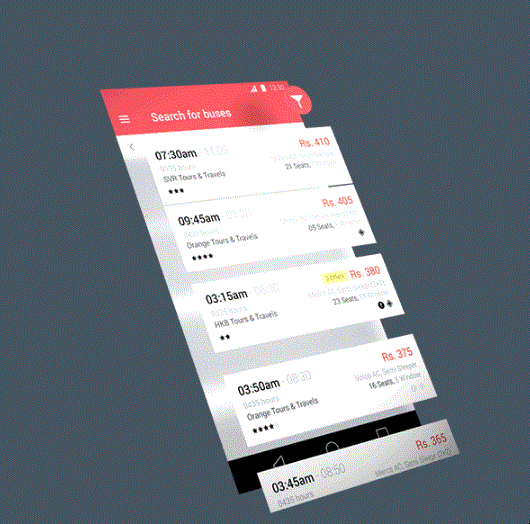
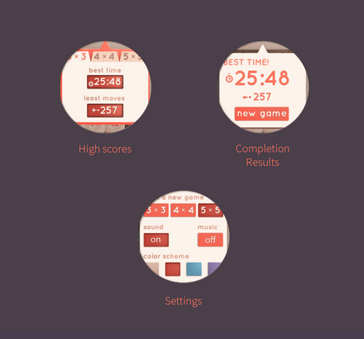
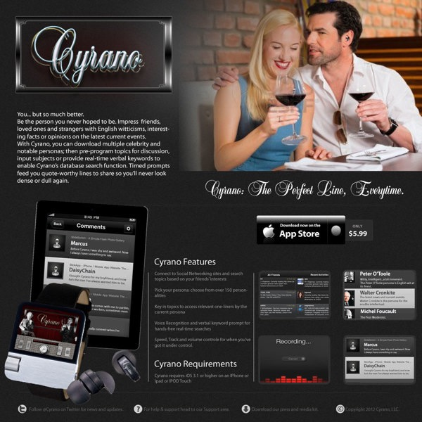

<!-- START doctoc generated TOC please keep comment here to allow auto update -->
<!-- DON'T EDIT THIS SECTION, INSTEAD RE-RUN doctoc TO UPDATE -->
**Table of Contents**  *generated with [DocToc](https://github.com/thlorenz/doctoc)*

- [【译文】Material Design 新手？来瞅瞅你需要知道的12条原则](#%E8%AF%91%E6%96%87material-design-%E6%96%B0%E6%89%8B%E6%9D%A5%E7%9E%85%E7%9E%85%E4%BD%A0%E9%9C%80%E8%A6%81%E7%9F%A5%E9%81%93%E7%9A%8412%E6%9D%A1%E5%8E%9F%E5%88%99)
  - [Material Design适合你吗？](#material-design%E9%80%82%E5%90%88%E4%BD%A0%E5%90%97)
  - [1.熟悉其核心思想](#1%E7%86%9F%E6%82%89%E5%85%B6%E6%A0%B8%E5%BF%83%E6%80%9D%E6%83%B3)
  - [2.理解Material Design中的“material”](#2%E7%90%86%E8%A7%A3material-design%E4%B8%AD%E7%9A%84material)
  - [3.通过阴影传达层级关系](#3%E9%80%9A%E8%BF%87%E9%98%B4%E5%BD%B1%E4%BC%A0%E8%BE%BE%E5%B1%82%E7%BA%A7%E5%85%B3%E7%B3%BB)
  - [4.醒目的配色](#4%E9%86%92%E7%9B%AE%E7%9A%84%E9%85%8D%E8%89%B2)
  - [5.使用主色调和重点色](#5%E4%BD%BF%E7%94%A8%E4%B8%BB%E8%89%B2%E8%B0%83%E5%92%8C%E9%87%8D%E7%82%B9%E8%89%B2)
  - [6.利用留白](#6%E5%88%A9%E7%94%A8%E7%95%99%E7%99%BD)
  - [7.使用无边框（edge-to-edge）的图片](#7%E4%BD%BF%E7%94%A8%E6%97%A0%E8%BE%B9%E6%A1%86edge-to-edge%E7%9A%84%E5%9B%BE%E7%89%87)
  - [8.对于依赖于图片的设计，要从图片中选出色彩](#8%E5%AF%B9%E4%BA%8E%E4%BE%9D%E8%B5%96%E4%BA%8E%E5%9B%BE%E7%89%87%E7%9A%84%E8%AE%BE%E8%AE%A1%E8%A6%81%E4%BB%8E%E5%9B%BE%E7%89%87%E4%B8%AD%E9%80%89%E5%87%BA%E8%89%B2%E5%BD%A9)
  - [9.动起来！](#9%E5%8A%A8%E8%B5%B7%E6%9D%A5)
  - [10.让运动更逼真](#10%E8%AE%A9%E8%BF%90%E5%8A%A8%E6%9B%B4%E9%80%BC%E7%9C%9F)
  - [11.让所有元素都可适应（不同设备）](#11%E8%AE%A9%E6%89%80%E6%9C%89%E5%85%83%E7%B4%A0%E9%83%BD%E5%8F%AF%E9%80%82%E5%BA%94%E4%B8%8D%E5%90%8C%E8%AE%BE%E5%A4%87)
  - [12.请铭记：成败在于细节](#12%E8%AF%B7%E9%93%AD%E8%AE%B0%E6%88%90%E8%B4%A5%E5%9C%A8%E4%BA%8E%E7%BB%86%E8%8A%82)

<!-- END doctoc generated TOC please keep comment here to allow auto update -->

## 【译文】Material Design 新手？来瞅瞅你需要知道的12条原则

> 本文译自： [New to Material Design? 12 Principles You Need to Know](http://blogs.adobe.com/dreamweaver/2015/05/new-to-material-design-12-principles-you-need-to-know.html)

Material Design现在变得很火了，许多设计师也不仅局限在Android项目中运用它，也开始在网页项目中运用了。

随口提一句，Material Design的概念最早是谷歌在[2014年开发者大会](https://www.youtube.com/watch?v=wtLJPvx7-ys#t=13m59)中提出的。到目前为止，这段演讲已经被查看了150万次以上，并且至今还被认为是了解和思考Material Design的一个极好的教程。

### Material Design适合你吗？

我们首先要解决的问题是：Material Design是否适合于你，到底应不应该去学它？

然后，就像大多数这种类型的问题一样，它没有标准答案。

让我们换个角度思考它吧。

我能够确信的一点是，**优秀的设计是独特而又实用的**。“实用”或是是更重要的一个因素。漂亮的设计更多的是一种附属。

因此，当我们试着接受Material Design设计原则的时候，试着去追溯根源，将你的设计的核心目标与它联系起来。之后，问问自己这个问题：

> Material Design的原则和指导方针是不是我想要达到的？

（Note：或许在你接着看下去之前，可以看看我们之前写的这篇文章：[Is Flat Design a Web Design Standard That’s Here to Stay?](http://blogs.adobe.com/dreamweaver/2015/02/is-flat-design-a-web-design-standard-thats-here-to-stay-10-designers-chip-in.html)。在这篇文章里，我们详细介绍了Flat Design和Material Design的不同。它或许能够给你选择自己的设计方案提供帮助。）

### 1.熟悉其核心思想

如果你想学Material Design，最好的开始方式就是去看[谷歌的官方文档](https://material.io/design/introduction/)

文档会实时保持更新，并且解释说明了在使用Material Design设计过程中的一些细节。

令人兴奋的是，Material Design不仅仅是Android设计，它涵盖囊括了各种App和web端的设计。

我墙裂建议你去仔细读一下文档的第一章，以便熟悉它的基础原则。

### 2.理解Material Design中的“material”

Material Design叫作Material Design，绝不仅仅是个巧合。Material Design中的核心观点是以抽象的形式，让设计接近于真实的世界。

不要让你的设计为了模仿真实世界而显得过于逼真。相反的，要给用户传达出一种“材质感”。

这就是问题的所在--我们--人类--理解并能够感受材料。我们能够感受到金属，能够感受到木质的桌子。我们可以区分不同层面的事物。例如，我们可以分辨出桌子上的放在纸上的笔。

在Material Design中，你首先需要学会仅仅使用少量的设计方式，例如阴影、色差等方法，表达不同元素的层级关系。

### 3.通过阴影传达层级关系

表面、边缘、逼真的阴影和光照，是Material Design中的主要工具。给你的设计增加深度至关重要，但一定记住要控制在有效的范围内。

举个栗子，阴影是你给一坨混合在一起的不同元素，增加层级关系的首选方案。为了决定谁在谁身上投射阴影，你需要思考各个元素的真实层级关系。

在这之中，起关键影响因素的是设计的整体结构。如果你的阴影描绘出了真实材料的质感，那么它将成为整个场景中的重要结构。

### 4.醒目的配色

醒目、平面，且富有意义，也是Material Design的指导方针。

毫无疑问，Material Design是极简抽象派的设计。换句话说，它不会用太多的设计或其他风格去修饰。反之，设计家们收到限制，不得不去寻找其他方式表达设计的意义和焦点。

其中的一点就是：颜色。更确切的说，是醒目，甚至有时会聒噪的配色。

醒目的配色在Material Design中扮演了重要角色（关于这点，Flat design也是）。它们让设计变的有趣并易于和用户进行（情感上的）交流。

举个富有色彩的栗子：

### 5.使用主色调和重点色

谷歌的官方文档是这么说的：

> 通过从主色调中选择三个颜色，从辅色调中选择一个重点色，来限制自己对颜色的选择。

(译者注：Material Design常用颜色戳[这里](http://flatuicolors.com/)，配色在App中的搭配戳[这里](http://www.materialpalette.com))

你的主色调可以用在背景色、大块区域、盒模型、字体，或者其他元素上。而重点色，则如同它的名字那样，为你页面上的重要元素添加额外的影响力。

不用说你也知道吧，重点色需要和主色调形成强烈的对比。

### 6.利用留白

Material Design从传统的印刷设计和原则中吸收了很多的灵感。

例如，留白。它在Material Design中占据重要地位。它可以极大的提高你的版面设计和文字布局的美观度。

事实上，在提升用户注意力方面，留白也是一个高效的工具。它能够吸引人们的注意力，并将其转移到特定的元素上（这点对于初学者来说通常难以理解）。

简而言之，在头部标题上使用一些大规模的版面吧，使用大量留白，别害怕在你的设计中留下大量的空白。

### 7.使用无边框（edge-to-edge）的图片

> 译者注： edge-to-edge design，无边框设计，无缝设计
>
> 它能最大限度的排除不必要元素的干扰，突出内容，带来沉浸感，更有利于专注于当前内容

Material Design于图片非常友好。如果你在设计中有包含任何图片元素，那么需要给它们一个统一的设计原则。

Material Design中的图片都具有无边框的特色--全出血（full-bleed）。这意味着图片之间，以及窗口之间的边缘没有边距。

> 译者注：full-bleed，全出血，印刷术语
> 
> 指印刷图象超出纸张四边

如果使用得当，它会给用户创造出一个诱人的体验，同时，相对于使用阴影、色调、图层而言，它也会带给我们--设计师--以额外的设计工具。

### 8.对于依赖于图片的设计，要从图片中选出色彩

谷歌提倡我们从图片提取其色调，让它成为我们配色面板的一部分。

这么做的理由难以反驳：通过这种方式，我们可以让一切都融为一体，给用户创造出一个统一的体验。

### 9.动起来！

运动，是好的Material Design中必不可少的一环。比较，我们在真实的世界中时刻体验着运动。它有助于我们理解事物的工作机理，把注意力集中在正确的方向。

Material Design就利用了这条简单的原则。将运动和用户管理，利用它可以有效的让用户知道如何去使用我们的设计。

如何加入运动？简单的对用户操作给予反馈即可。比如，用户按下按钮了吗？那就让按钮动起来，表达它刚刚接受到了用户的操作。

### 10.让运动更逼真

“逼真”是关键词。虚假动画的时代--元素仅仅是在屏幕上移动--不复存在。如果你要加入运动效果，你还需要遵守真实世界的物理学运动规律，让它感受起来更加逼真。

谷歌针对[逼真运动](http://www.google.com/design/spec/animation/authentic-motion.html)这点有专门的介绍

谷歌在指导方针中，解释了质量和重量、加速和减速，以及变速运动的原理（就是让运动物体的速度随着时间而改变）。

在Material Design中，只有当运动和真实的世界一样时，才能达到良好的效果：丰富界面，更利于用户理解。

### 11.让所有元素都可适应（不同设备）

Material Design里有一个指导方针是，让事物的工作结果，在不同设备不同屏幕上都可以被触发并可用。它的目标，是创造一个连贯的用户体验。这样的话，当用户改变自己的设备的时候，能够获得完全一样的界面，因而不会有任何的困惑。

对于好的Material Design，它可以做到在app/web之前无缝切换，并且保留用户的操作状态。

自然而然，这要求设计可以适应不同场景。幸运的是，在现代的框架下，你能够获取到很多现成的工具，因此这也并不是什么特别大的挑战。

### 12.请铭记：成败在于细节

Material Design不易做到的原因之一是，有着如此之多繁重而又简单的原则。

举个栗子吧，对于拟物化设计，原则很简单：“让设计的元素尽可能的接近真实世界的事物”。

下面是遵照这个原则进行的设计：

以及这个：

而Material Design则就简单的多。但同时，也复杂的多。

最重要的一点：Material Design是一场有关细节的游戏。你需要更加务实专注的把设计转换为想要达到的目标，但同时，也不能太拟物。当你有疑问时，可以[来这里寻找灵感](https://www.behance.net/search?field=102&content=projects&sort=appreciations&time=week&search=material%20design)。
