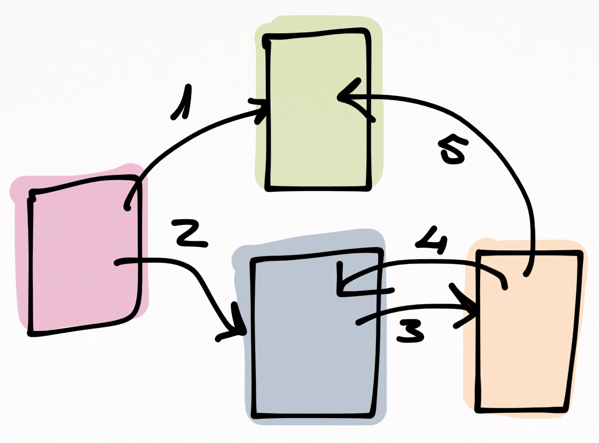

<!-- START doctoc generated TOC please keep comment here to allow auto update -->
<!-- DON'T EDIT THIS SECTION, INSTEAD RE-RUN doctoc TO UPDATE -->
**Table of Contents**  *generated with [DocToc](https://github.com/thlorenz/doctoc)*

- [【译文】React Native中的Routing和Navigation](#%E8%AF%91%E6%96%87react-native%E4%B8%AD%E7%9A%84routing%E5%92%8Cnavigation)
  - [为何是navigation](#%E4%B8%BA%E4%BD%95%E6%98%AFnavigation)
  - [navigation为什么这么可怕](#navigation%E4%B8%BA%E4%BB%80%E4%B9%88%E8%BF%99%E4%B9%88%E5%8F%AF%E6%80%95)

<!-- END doctoc generated TOC please keep comment here to allow auto update -->

## 【译文】React Native中的Routing和Navigation

Note：本文是[《Programming React Native》](https://leanpub.com/programming-react-native)一书的一部分。祝看的愉快！

### 为何是navigation

你或许已经问过自己这个问题了：为什么要用navigation？什么是navigation的堆栈？在手机上，navigation占据着重要的作用。

  - 情境意识：让你在应用中知道自己在哪儿，以及从哪儿过来的
  - 功能：可以导航。后退、撤销、跳过，或者深度链接到App中的某些功能
  - 基础设施：在渲染一个新屏幕之前完成一个统一的视觉效果
  - 可维护性：想要理清上面的疑虑，你需要先建立一个掌控state的机器。navigation的堆栈就是这样的机器。我们编程的平台或许允许我们对这个机器的编码进行改变，并通过将逻辑集中在一处来提高维护性。

### navigation为什么这么可怕

在我看来，在开发手机端应用的时候，最可怕的就是路由和导航了。

navigation的典型基础功能涵盖了一个导航栈，它连接着屏幕，组件和数据。它的状态不会在其他地方声明，而是当用户产生跳转行为的时候产生的短暂数据，这也就是为什么它难以分析的原因。

navigation的工作流也难以复现。